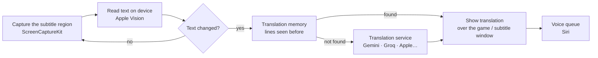

# OverSub

**Translated subtitles, voice-over and on-screen translation for any game on your Mac.**

OverSub reads the text in your game right off the screen, translates it with AI and lays the translation over the original text, reads dialogue aloud with a Siri voice, and translates menus and quest logs in place.

[Tiếng Việt](README.md) · **English**

---

## Contents

- [What OverSub does](#what-oversub-does)
- [Requirements](#requirements)
- [Installation](#installation)
- [Get started in 5 minutes](#get-started-in-5-minutes)
- [Detailed guide](#detailed-guide)
- [Translation services and API keys](#translation-services-and-api-keys)
- [Shortcuts and controller](#shortcuts-and-controller)
- [How it works](#how-it-works)
- [Privacy and data](#privacy-and-data)
- [FAQ and troubleshooting](#faq-and-troubleshooting)
- [Known limitations](#known-limitations)
- [Feedback and bug reports](#feedback-and-bug-reports)
- [Support OverSub](#support-oversub)
- [Copyright](#copyright)

---

## What OverSub does

OverSub works with **any game shown on your Mac's screen**: Mac games, Windows games through CrossOver or Whisky, cloud gaming, or consoles (Switch, PlayStation…) played through a capture card and a viewer app such as OBS or VisionRelay. It never touches the game; it only looks at the screen, like you do.

Three main features, each turned on or off independently in the main window: the Subtitles button on the left, the OverSub mascot in the middle (the voice; click it to turn the voice on or off, and it moves its mouth while speaking), and the Screen translation button on the right:

| | Feature | What it does |
|---|---|---|
| 💬 | **Subtitles** | Reads dialogue in the region you select, translates it and shows the translation right over the original subtitle: same position, same text colour, same alignment. Or read it in a separate **subtitle window**. |
| 🔊 | **Voice-over / Dub** | Reads the translated dialogue aloud. *Voice-over*: one Siri voice for every line. *Dub (beta)*: a voice per character, by gender and age. The voice follows the emotion of each line and speeds up when dialogue comes fast. |
| 🖼️ | **Screen translation** | Translates non-dialogue text in place: menus, quest logs, item descriptions, letters. The original text is erased by rebuilding the game's background, and the translation uses the same colour and fits inside the box. Up to 3 regions. |

Plus:

- **Quick translate** (⌃⌥Q): press the shortcut anywhere, drag a box around some text, and the translation appears in place when you let go. A button copies the original text so you can look it up.
- **Subtitle window**: a floating window with just the dialogue. Pin it above every Space (including full-screen games), shrink it to a thin strip so it doesn't cover the game; the text lights up as it's read aloud.
- **Many translation services**: Gemini, Groq, Cerebras, Mistral, OpenRouter (all with free tiers), any paid OpenAI-style service (OpenAI, DeepSeek, xAI…), and Apple's two on-device engines, which need no internet. OverSub measures each service's speed and switches automatically when one is slow or out of quota.
- **Translations that fit the game**: pick a genre (Medieval Europe, Wuxia, Anime/JRPG, Street…) so the AI chooses the right forms of address and tone, or describe the setting yourself with the *Custom* genre. Each character keeps consistent forms of address, proper names stay as they are, and there is a glossary.
- **Game profiles**: each game keeps its own settings (regions, voice, genre, glossary, translation memory), switched automatically when you open the game.
- **Global shortcuts** that work in full-screen games (customisable), and **game controller** control.
- Interface in **Vietnamese and English**. Translates into 12 languages; Vietnamese has its own tuned guide for forms of address and style.

 
The subtitle window, with controls shown on hover

---

## Requirements

- **macOS 26 or later** on a **Mac with Apple silicon** (M1 or later).
- **Screen Recording permission** (macOS asks the first time).
- A **free API key** from Gemini or Groq is recommended for the best translations. Without one, OverSub still translates with Apple Translation and Apple Intelligence (if Apple Intelligence is turned on on your Mac).
- For natural Vietnamese speech, download a **Vietnamese Siri voice** in System Settings. The app includes a step-by-step guide.

## Installation

1. Go to [**Releases**](https://github.com/imhillxtz/oversub-mac/releases/latest) and download `OverSub-x.y.z.dmg`.
2. Open the `.dmg` and drag **OverSub** into **Applications**.
3. Open OverSub. The first time, macOS blocks it because the app isn't notarized by Apple yet. This is normal for apps shared outside the App Store by an author without a paid Apple developer account.
   - Go to **System Settings → Privacy & Security**, scroll down, click **Open Anyway** next to OverSub, and confirm.
4. Follow the in-app guide. After granting **Screen Recording**, **quit OverSub completely (⌘Q) and open it again** so the permission takes effect.

### Updates

From version 1.1.42, OverSub **checks for new versions** on the Releases page (about twice a day). When one is out, the status line at the bottom of the main window shows **Version x is available · Update**: click it and the app downloads it, verifies its digital signature, replaces the old version and reopens. To avoid interruptions while playing, turn on **Download updates automatically and install when quitting** in **Settings → General**: the new version is swapped in when you quit OverSub. Settings, keys, game profiles and the Screen Recording permission are all kept.

Versions 1.1.41 and earlier don't have this yet: download the new `.dmg` and drag it over the old app once.

---

## Get started in 5 minutes

1. **Follow the first-run guide** (5 steps): permission, game language and target language, features, Siri voice, region.
2. **Add a free key** (recommended): get one from [Google AI Studio](https://aistudio.google.com/apikey) or [Groq](https://console.groq.com/keys), then go to **Settings → Translation services**, paste it and click **Check & add**. Only working keys are added.
3. **Select the subtitle region**: open your game at a point with dialogue, click **Select subtitle region** (⌘K, or ⌃⌥K in game) and drag a box around where subtitles appear. Include the **character name label** if the game has one. Click **Done**, check the text that was read, then **Save**.
4. **Click Start** (⌘R, or ⌃⌥S in game).
5. Turn **Subtitles**, **Voice-over** (click the mascot in the middle) and **Screen translation** on or off as you like.

---

## Detailed guide

### Selecting regions

The region picker opens on a **live view** of the screen. Click **Freeze frame** (or press Space) to select on a still image when subtitles go by too fast.

- **Subtitle region** (one): where dialogue appears. There's a **Find subtitles** button.
- **Screen regions** (up to 3): around menus, quest logs, item description boxes. Click **Add screen region** in the toolbar.
- Drag to move, drag a corner to resize, Delete removes a region. Click **Done** (Enter) to review the text read in every region, then **Save** or **Save & start**.
- When regions overlap, subtitles take priority, so you never get two translation layers on top of each other.

### Dialogue capture

In **Settings → Subtitles**, pick the mode that matches how the game shows text:

| Mode | Best for |
|---|---|
| **Typewriter text** | Games that reveal text letter by letter (many RPGs). Each finished phrase is translated as it appears and read as soon as a sentence is complete, without waiting for the whole passage. Also handles fast-changing cutscene subtitles well. |
| **Balanced** | Subtitles that appear a whole line at a time. Translated after two identical reads. |
| **Wait for full line** | Text that keeps changing and needs to settle before translating. |

### Subtitles over the game and the subtitle window

- **Subtitles over the game**: the translation covers the original subtitle exactly. In **Settings → Subtitles**: background style, text size, alignment, position offset, showing the original line too.
- **Subtitle window** (⌘J): a separate floating window, great on a second display or when you want the game image untouched. Hover to show the controls:
  - left edge: **Start / Stop** and **Ignore this line**;
  - right edge: **Pin** (float above every Space, including full-screen games; it opens pinned), **One line** (shrink to a thin strip that fits the black bar under the game), **Background** (blur, darkness), **A− / A+**.

 
One-line mode: the speaker's name comes first, long lines shrink to fit

### Voice

- **Voice-over**: one Siri voice reads every line, fast and consistent. It reads only **dialogue in the subtitle region**, never text in screen regions.
- **Dub (beta)**: each character (recognised from the name label on the dialogue box) gets a voice by gender and age; monsters and robots get their own voice. The cast and their voices are in **Settings → Characters** (shown when Dub is selected).
- **Siri voice**: macOS only lets other apps use the Siri voice selected in **System Settings → Accessibility → Spoken Content**. Click **Change Siri voice…** in the app (in **Settings → Voice** or the Siri voice step of the first-run guide): a guide panel sits next to System Settings and ticks off each step as you complete it.
- **Pacing**: speed adapts to the pace of the dialogue, lines that fall too far behind are dropped so the voice keeps up with the screen, and the voice follows emotion (shouting or excited lines are read faster, hesitant or sad lines slower and quieter).
- **Audio**: choose separate speakers or headphones for the voice; optionally lower the game's own volume while the voice is speaking.
- Replay the last line: ⌃⌥R.

 

### Screen translation

Translates interface text in place. Each piece of text (menu item, button, description) is replaced on its own: the original is erased by rebuilding the background from the surrounding pixels, and the translation uses the same colour, a size estimated from the original, and always stays inside its box.

- Three speed modes: **Instant** (Apple Translation), **Instant, then refined by AI** (default), **Wait for AI**.
- Text seen before is remembered and shown instantly at no cost. Lines with numbers like "Gold 120" are stored as a template, so a new number is filled in without asking the AI.
- Proper names, brands and button symbols (A, B, ZL…) are kept as they are.

 

### Quick translate

Press **⌃⌥Q** anywhere (no need to click Start), drag a box around some text, and the translation appears in place when you let go. Three buttons sit below the box: **show as text** (with a button to copy the translation), **copy the original**, **close**. Keys: ⌘C copies the original, ⇧⌘C the translation, Esc closes. The screen is frozen while you select by default; turn that off in **Settings → Screen translation**.

### Style, forms of address and proper names

- **Game genre** decides forms of address and tone, e.g. Medieval Europe uses "my lord" and rank-based address in Vietnamese, Wuxia uses classical forms, School uses casual forms.
- **Custom**: describe the game's setting, characters and relationships, forms of address, tone, formality, profanity, honorifics and any other instructions, and preview the guide sent to the AI.
- **Consistent forms of address**: the speaker's name and the last few lines are sent along, so each pair of characters keeps one way of addressing each other.
- **Proper names and glossary**: character, place, monster and skill names stay as in the original; add them to the list to make sure, or set a fixed translation.
- **Ignore this line**: when the app translates a logo or fixed on-screen text, click the button with the text-and-× icon (main window, subtitle window or History). That text is never translated or read again.

 

### Game profiles and history

- **Game profiles** keep everything per game: regions, languages, voice, genre, glossary, dialogue context and translation memory. Changes save automatically to the active profile. Opening a game switches to its profile; for consoles played through a capture-card viewer, pick the profile by hand.
- **Dialogue history** (⌘L, or ⌃⌥L in game): review recent lines you missed, replay them, ignore a line, or keep a name untranslated.

### Appearance

- **Light / dark**: **Settings → General → Appearance**, choose *System*, *Light* or *Dark*. The subtitle window and in-game translations always use a dark background for readability.
- The app icon follows the icon style you pick in macOS (light, dark, tinted, clear).

---

## Translation services and API keys

Add keys in **Settings → Translation services**. You can add several keys and several services: when a quota runs out the app moves to the next key or service, and a slow or failing service drops to the back of the queue.

| Service | Cost | Notes |
|---|---|---|
| **Gemini** | Free, with quotas | The best translations among the free options. Quota is **per Google Cloud project**, not per key: two keys from one project share the same quota. For a backup, add a key from another service. [Get a key](https://aistudio.google.com/apikey) |
| **Groq** | Free, with quotas | Very fast (about 0.3–0.5 seconds per line). [Get a key](https://console.groq.com/keys) |
| **Cerebras** | Free, with quotas | About as fast as Groq, with a daily token quota. [Get a key](https://cloud.cerebras.ai) |
| **Mistral** | Free, with quotas | Generous free plan but one request per second; a good backup. [Get a key](https://console.mistral.ai/api-keys) |
| **OpenRouter** | Some free models | One key for many models; free models end in `:free`. [Get a key](https://openrouter.ai/keys) |
| **Custom service** | Paid by usage | Any OpenAI-style API: OpenAI, DeepSeek, xAI (Grok), Together, Fireworks… Enter the address, model name and key. |
| **Apple Intelligence** | Free, on device | No internet needed; requires Apple Intelligence to be turned on. |
| **Apple Translation** | Free, on device | Fastest, no internet needed; doesn't follow instructions about forms of address. Needs a language pack (the app has a download button). |

> Free quotas are set by each provider and change over time; check the provider's site for the exact numbers on your account.

**Priority order**: *Balanced* (default), *Prefer quality*, *Prefer speed* or *Custom* (your own order). The app measures each service's real speed (median of the last 20 requests, penalised when it fails often) to order them. If the first service hasn't answered after 1 second, the next one is asked in parallel and whichever answers first is used.

---

## Shortcuts and controller

Global shortcuts work even when the game is full screen, with no Accessibility permission needed. **Change them** in **Settings → Shortcuts & controller**: click a shortcut and press the new combination.

| Default | Action |
|---|---|
| ⌃⌥S | Start / Stop |
| ⌃⌥H | Hide / show subtitles over the game |
| ⌃⌥D | Turn voice on / off |
| ⌃⌥R | Replay last line |
| ⌃⌥T | Turn screen translation on / off |
| ⌃⌥Q | Quick-translate an area |
| ⌃⌥K | Select subtitle region |
| ⌃⌥L | Dialogue history |

In the OverSub window: ⌘R start/stop, ⌘K select region, ⌘J subtitle window, ⌘E quick translate, ⌘L history, ⇧⌘H subtitles, ⇧⌘D voice, ⇧⌘T screen translation.

**Controller** (Xbox, PlayStation, Switch Pro…): hold **View / Share** and press **Y (△)** to replay the last line, **X (□)** to turn the voice on or off, **B (○)** to hide or show subtitles.

The controller icon in the menu bar also controls everything without opening a window.

---

## How it works

- **Screen capture** uses ScreenCaptureKit and *excludes OverSub itself*, so a translation that was just drawn is never captured and read back.
- **Text recognition runs entirely on your Mac** with Apple Vision. Each tick does a fast read (about 14 ms) to see whether the text changed; only then does it do an accurate read (about 120 ms). Moving backgrounds don't trigger constant re-reads.
- **Speaker labels** are separated from dialogue by their size and colour; names seen before are remembered so they're recognised even when stuck to the start of a line.
- **Typewriter text**: each finished phrase (up to a comma or full stop, or a few words) is translated as it appears; phrases of the same line are translated in order to keep context. Translation runs separately, so the capture loop never waits for the AI and doesn't miss cutscene subtitles.
- **Translation**: the game profile's translation memory is checked first; otherwise the line is sent with a few previous lines, the speaker's name, the genre and glossary terms to the first service in line, and to the next one in parallel if the first is slow. Proper names are swapped for placeholder codes before sending so the AI can't translate them away.
- **The voice** queues lines and never cuts one off; a line that waited too long while newer ones arrived is dropped so the voice keeps up; the same line is never read twice when OCR flickers or when you switch apps and come back.
- **Screen translation** detects changes by text content (not pixels), rebuilds the background under the original text in about 10 ms, and squeezes text slightly before shrinking it so the translation fits its box.

Technical details (in Vietnamese): [Docs/DEVELOPMENT.md](Docs/DEVELOPMENT.md).

---

## Privacy and data

- **Screenshots never leave your Mac.** Text recognition runs entirely on your Mac.
- With an online translation service, **only text** is sent, and only to the service you chose: the line to translate, a few previous lines for context, and character names. With Apple Translation or Apple Intelligence nothing leaves your Mac.
- OverSub has **no server of its own**, collects no analytics and shows no ads.
- **Update checks** only query the public Releases page on GitHub and send nothing about you. A downloaded installer is only installed if its digital signature matches the author's key built into the app.
- **API keys** are stored in `~/Library/Application Support/OverSub/keys.json`, readable only by your user account (permissions 0600).
- App data: profiles, context and translation memory in `~/Library/Application Support/OverSub`. A diagnostic log is kept at `~/Library/Logs/OverSub/debug.log`; it contains text read from your games and can be deleted at any time.

---

## FAQ and troubleshooting

<b>macOS won't open OverSub</b>

The app isn't notarized by Apple, so it's blocked the first time. Go to **System Settings → Privacy & Security**, scroll down and click **Open Anyway** next to OverSub.

<b>I granted Screen Recording but the app still says it's missing</b>

macOS applies a new permission only after the app restarts. Quit OverSub completely (⌘Q, or the controller icon in the menu bar → Quit) and open it again.

<b>The voice isn't a Siri voice</b>

Go to **Settings → Voice**, click **Change Siri voice…** and follow the guide: download a Siri voice for your language and select it under *Spoken Content* in System Settings.

<b>Translations are slow, or suddenly switch to machine translation</b>

Usually a key has run out of quota. See **Settings → Translation services** for each key's status (and when it will work again) and the service switch log. Add a key from another service (Groq, Cerebras…) as a backup.

<b>The app doesn't pick up subtitles, or reads them wrong</b>

- Re-select the subtitle region to fit snugly, ideally including the character name label.
- Try another **Dialogue capture** mode (*Typewriter text* for games that reveal text letter by letter).
- Check that **Game language** matches the subtitle language.
- With *Run only while the game is in front* on, the app pauses when you switch to another app.

<b>The app translates a logo or fixed on-screen text</b>

Click **Ignore this line** (the text-and-× icon). The list of ignored lines can be reviewed and cleared in **Settings → Style & glossary**.

<b>Character names get translated</b>

Turn on **Keep proper names as is** and add the names in **Settings → Style & glossary**, or click **Keep a name untranslated…** in the main window to pick names from the current line.

---

## Known limitations

- Runs only on **macOS 26 or later** on **Apple silicon** Macs.
- The app is **not notarized by Apple** yet, so you need *Open Anyway* the first time.
- Reading **Japanese, Korean and Chinese** text hasn't been tested thoroughly on real games.
- Regions are stored as screen coordinates: re-select them after changing resolution or displays.
- Dub uses Apple voices; Gemini voices are turned off for now because they're still slow (4–8 seconds per line).
- Cerebras, Mistral, OpenRouter and custom services have been tested for connectivity, not yet in long play sessions.

---

## Feedback and bug reports

All feedback is welcome, especially from players of different games.

- **Bugs or feature ideas**: open an [Issue](https://github.com/imhillxtz/oversub-mac/issues). Include your OverSub version (**Settings → General**), the game, how it shows subtitles, and if possible part of the log around the problem (`~/Library/Logs/OverSub/debug.log`; review it before sending, as it contains text from your game).
- **Games that work well**: a short Issue like "game X works well with mode Y" helps the next player a lot.
- **Code contributions**: the source is public for everyone to read, but copyright is reserved. If you'd like to contribute code, please open an Issue to discuss it first.

---

## Support OverSub

OverSub is free for everyone. If it makes your games more fun, buy me a coffee to keep it going.

- **International**: [paypal.me/ngochieuit](https://paypal.me/ngochieuit).
- **In Vietnam**: scan the VietQR code with a banking app, MoMo or ZaloPay (recipient TRINH NGOC HIEU, MoMo wallet, message "OverSub"). In the app, click **♥ Support** at the bottom of the main window to pick an amount quickly and add your name to the code.
- **Free ways to help**: star this repository on GitHub, or tell a friend who plays games.

 

### Thank-you list

Thank you to everyone who has supported OverSub. To have your name here (and in the app's Support window), type a name or nickname in the **Your name** field of the Support window: the QR code adds it to the transfer message (many banking apps don't let you edit the message after scanning). For a manual transfer, use the message "OverSub your-name"; with PayPal, put your name in the note. Leave it out to stay anonymous.

<!-- Newest first; the in-app list comes from Docs/supporters.json -->
*No names yet. You could be the first ♥*

---

## Copyright

© 2026 imhillxtz. **All rights reserved.**

The source code is public so anyone can read it and check what the app does on their Mac. **This is not open-source software**: copying, modifying, redistributing or commercial use is not permitted without the author's written permission. The official builds on the Releases page are free to use. See [LICENSE](LICENSE).

Game names and trademarks mentioned belong to their respective owners. OverSub uses services and technologies from Apple, Google, Groq, Cerebras, Mistral and OpenRouter under each provider's terms.
