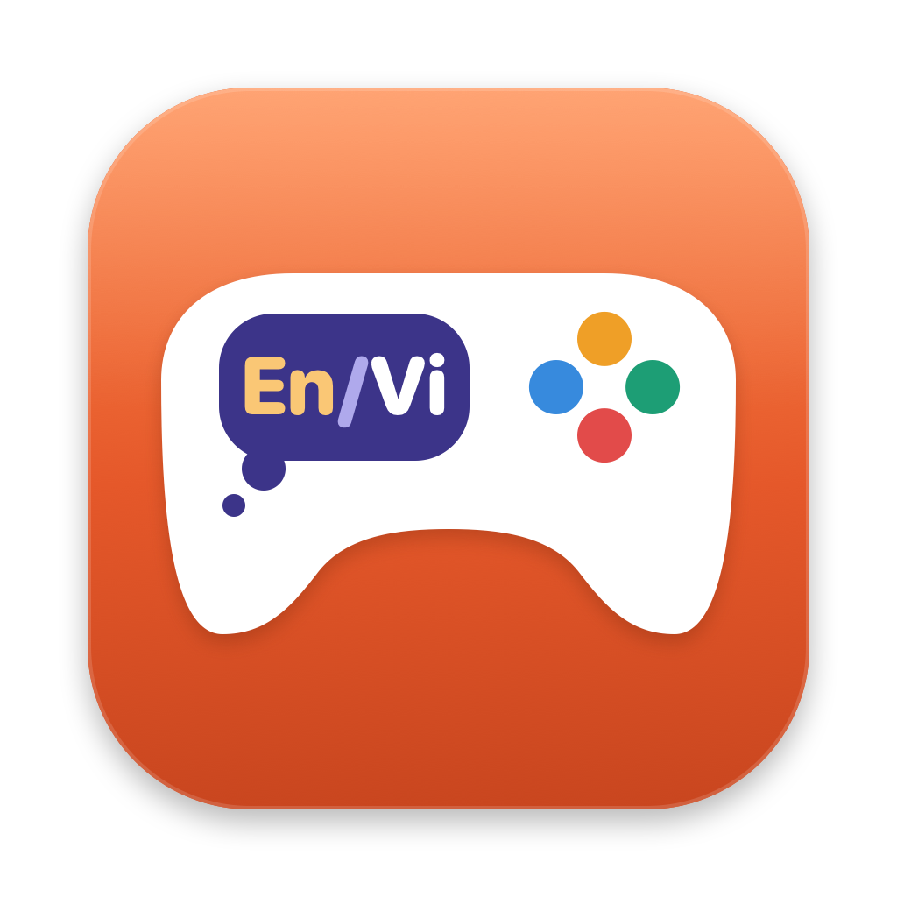
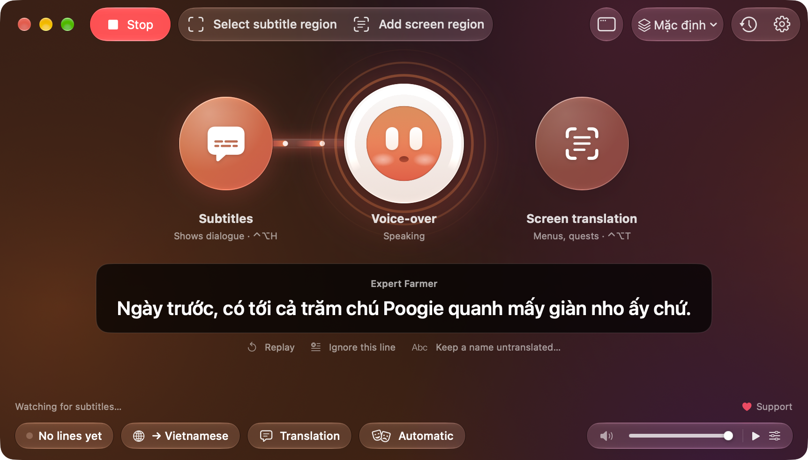
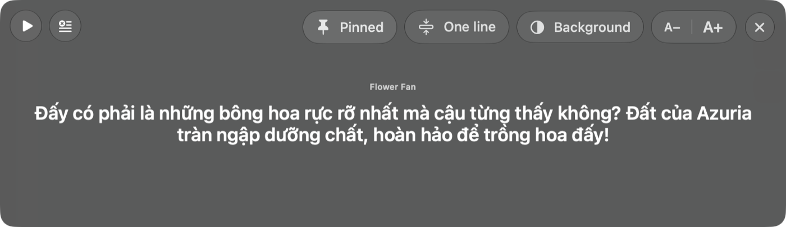
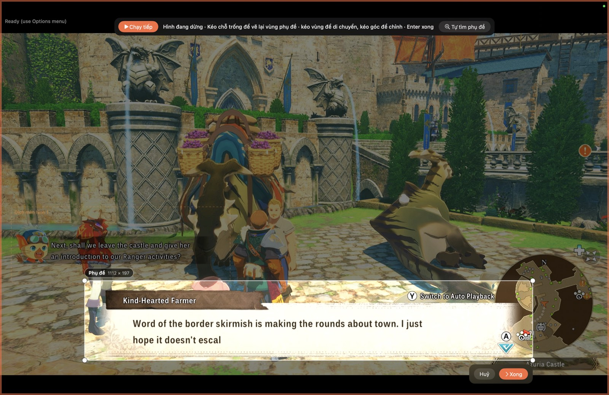
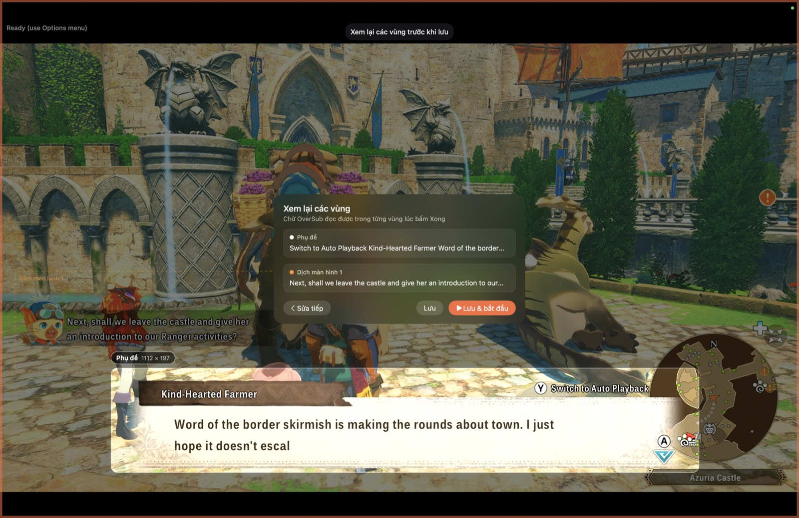
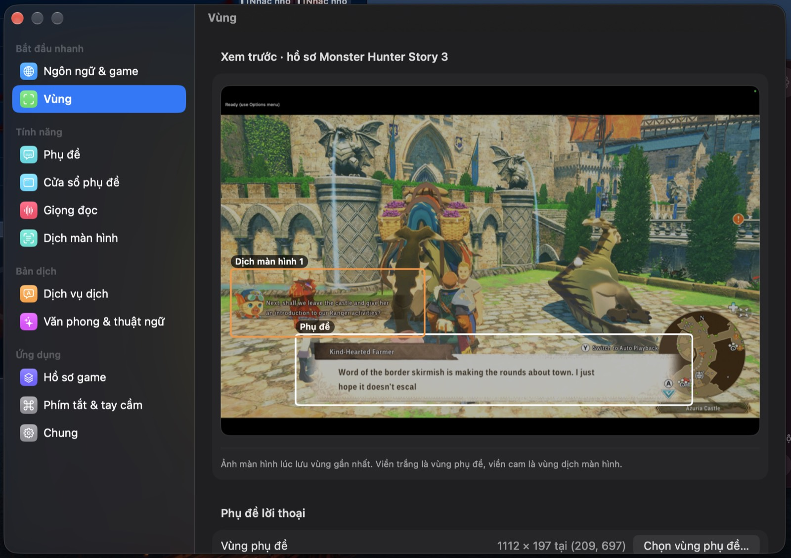
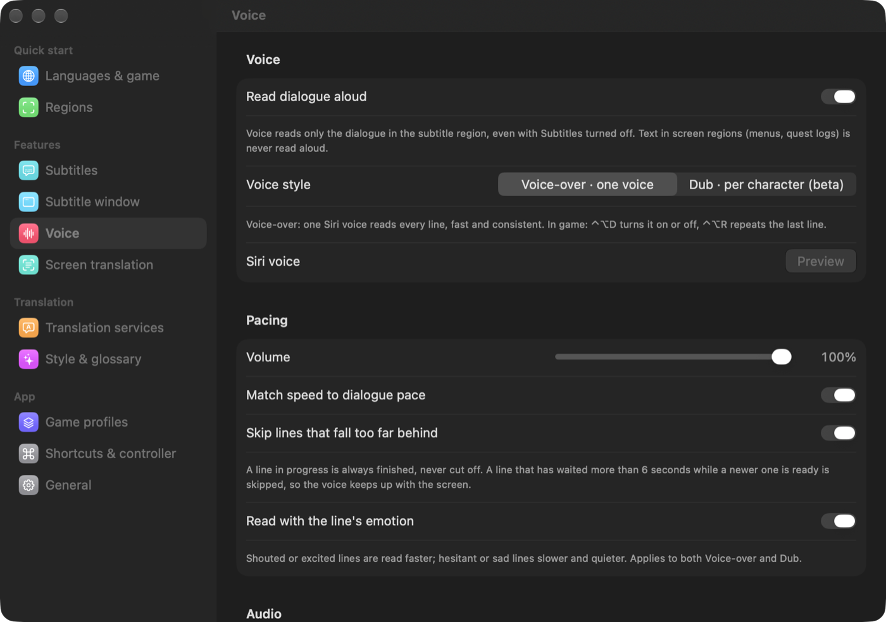
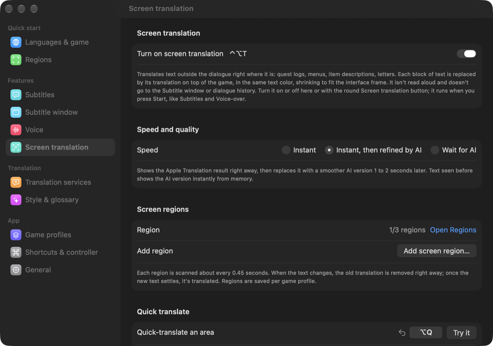
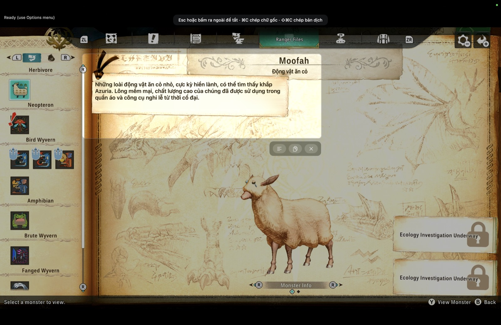
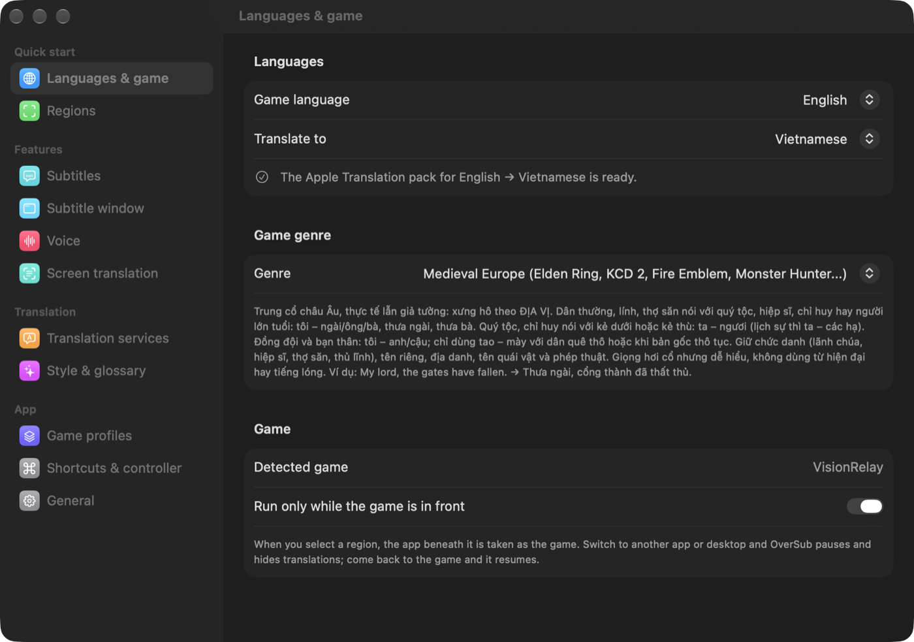

# OverSub

Vietnamese subtitles, voice and screen translation for any game on your Mac.

OverSub reads the text in your game from the screen, translates it with AI and draws the translation over the original text. It reads dialogue aloud with a Siri voice and translates menus and quest logs in place.

[Tiếng Việt](README.md) · English

## Contents

- [What OverSub does](#what-oversub-does)
- [Requirements](#requirements)
- [Installation](#installation)
- [Get started in 5 minutes](#get-started-in-5-minutes)
- [Detailed guide](#detailed-guide)
- [Translation services and API keys](#translation-services-and-api-keys)
- [Shortcuts and controller](#shortcuts-and-controller)
- [How it works](#how-it-works)
- [Privacy and data](#privacy-and-data)
- [FAQ and troubleshooting](#faq-and-troubleshooting)
- [Known limitations](#known-limitations)
- [Feedback and bug reports](#feedback-and-bug-reports)
- [Support OverSub](#support-oversub)
- [Copyright](#copyright)

## What OverSub does

OverSub works with any game shown on your Mac's screen: Mac games, Windows games through CrossOver or Whisky, cloud gaming, and consoles (Switch, PlayStation) played through a capture card, shown right in OverSub's game screen or in a viewer app such as OBS. It doesn't touch the game. It only looks at the screen, the same way you do.

The main window has three switches: Subtitles on the left, the OverSub mascot in the middle (the voice; it moves its mouth while speaking) and Screen translation on the right.

https://github.com/user-attachments/assets/db2bf69f-3bb9-4343-82d8-905128e31e92

The main window with its three switches: Subtitles, Voice-over and Screen translation. While OverSub is reading dialogue aloud, the mascot in the middle moves its mouth. The text in the videos and screenshots on this page is Vietnamese, because the app was set to translate into Vietnamese.

| Feature | What it does |
|---|---|
| Subtitles | Reads dialogue in the region you select, translates it and shows the translation over the original subtitle, in the same position, colour and alignment. You can read it in a separate subtitle window instead. |
| Voice-over / Dub | Reads the translated dialogue aloud. Voice-over uses one Siri voice for every line. Dub (beta) gives each character a voice by gender and age. The pace follows the emotion of each line and speeds up when dialogue comes fast. |
| Screen translation | Translates non-dialogue text in place: menus, quest logs, item descriptions, letters. The original text is erased by rebuilding the game's background; the translation uses the same colour and fits inside the box. Up to 3 regions. |

Other features:

- Quick translate (⌃⌥Q): press the shortcut anywhere, drag a box around some text and let go to see the translation in place. Buttons copy the translation or show the original text so you can look it up.
- Game screen: connect a capture card and the bottom of the main window shows the card's name with a button to open it. Your console's picture and sound play in an OverSub window, no separate viewer app needed, and subtitles, voice and screen translation work on it like on any other game.
- Subtitle window: a floating window with just the dialogue. It stays above every Space, including full-screen games, and shrinks to a thin strip so it doesn't cover the game. The text lights up as it's read aloud.
- Translation services: Gemini, Groq, Cerebras, Mistral and OpenRouter (all with free plans), paid OpenAI-style services (OpenAI, DeepSeek, xAI), and Apple's two on-device engines, which work offline. The app measures each service's speed and moves to another one when a service is slow or out of quota.
- Game genres: pick Medieval Europe, Wuxia, Anime/JRPG, Street and so on, and the AI uses forms of address and tone to match, or describe the setting yourself with the Custom genre. Each pair of characters keeps the same forms of address, proper names stay as they are, and there's a glossary.
- Game profiles: each game keeps its own settings (regions, voice, genre, glossary, translation memory). Opening a game switches to its profile.
- Global shortcuts that work in full-screen games and can be changed. Game controller support.
- Interface in Vietnamese and English. Translates into 12 languages; Vietnamese has its own guide for forms of address and style.

 
The subtitle window, with controls shown on hover

## Requirements

- macOS 26 or later on a Mac with Apple silicon (M1 or later).
- Screen Recording permission. macOS asks the first time.
- For the game screen: Camera permission (macOS treats capture cards as cameras) and Microphone permission (game sound from the card reaches the Mac as a microphone input). macOS asks the first time you open the game screen.
- A free API key from Gemini or Groq is recommended for the best translations. Without one, OverSub translates with Apple Translation and Apple Intelligence (if Apple Intelligence is turned on on your Mac).
- For natural Vietnamese speech, download a Vietnamese Siri voice in System Settings. The app walks you through it.

## Installation

1. Go to [Releases](https://github.com/imhillxtz/oversub-mac/releases/latest) and download `OverSub-x.y.z.dmg`.
2. Open the `.dmg` and drag OverSub into Applications.
3. Open OverSub. The first time, macOS blocks it because the app isn't notarized by Apple. OverSub is distributed outside the App Store without a paid Apple developer account, so it can't be notarized yet; any app in that situation is blocked the same way. The source code is public here if you'd like to check it. Go to System Settings → Privacy & Security, scroll down, click **Open Anyway** next to OverSub and confirm.
4. Follow the in-app guide. After granting Screen Recording, quit OverSub completely (⌘Q) and open it again so the permission takes effect.

### Updates

Since version 1.1.42, OverSub checks the Releases page for new versions about twice a day. When one is out, the status line at the bottom of the main window shows "Version x is available · Update". Click Update and the app downloads it, verifies its digital signature, replaces the old version and reopens. Click "What's new" on that line, or choose OverSub → Check for Updates… in the menu bar, to open the update window: it lists the changes in every version since the one you have, with Update, Later and Skip This Version buttons. If you don't want an interruption while you play, turn on "Download updates automatically and install when quitting" in Settings → General; the new version is then swapped in when you quit OverSub. Settings, keys, game profiles and the Screen Recording permission are kept.

Versions 1.1.41 and earlier can't update themselves. If you're on one of those, download the new `.dmg` and drag it over the old app once; later versions update themselves.

## Get started in 5 minutes

1. Follow the first-run guide (5 steps): permission, game language and target language, features, Siri voice, region.
2. Add a free key (recommended): get one from [Google AI Studio](https://aistudio.google.com/apikey) or [Groq](https://console.groq.com/keys), go to Settings → Translation services, paste it and click Check & add. The app tests the key first and only adds it if it works.
3. Add the subtitle region: open your game at a point with dialogue, click Add subtitle region (⌘K, or ⌃⌥K in game) and drag a box around where subtitles appear. Include the character name label if the game has one. Click Done, check the text that was read, then click Save.
4. Click Start (⌘R, or ⌃⌥S in game).
5. Turn Subtitles, Voice-over (click the mascot in the middle) and Screen translation on or off as you like.

## Detailed guide

The sections below follow the order you'll meet things in: selecting regions, choosing how dialogue is captured, then subtitles, voice and style.

### Selecting regions

The region picker opens on a live view of the screen. If subtitles go by too fast, click Freeze frame (or press Space) and select on a still image.

 
The picture is frozen, so there's no rush. Drag a box around the dialogue box and include the speaker's name label.

The subtitle region (only one) is where dialogue appears; the Find subtitles button can guess it for you. Screen regions (up to 3) go around menus, quest logs or item description boxes; add one with Add screen region in the toolbar. Once regions exist, the two buttons change to Edit subtitle region and Edit screen regions (with a count such as 2/3) for moving, resizing, removing or adding regions.

Drag to move, drag a corner to resize, press Delete to remove a region. Click Done (Enter) to review the text read in every region, then Save or Save & start. When regions overlap, subtitles take priority, so two translation layers never sit on top of each other.

 
After you click Done, OverSub lists the text it read in each region so you can check it before choosing Save or Save &amp; start.

 
Settings → Regions keeps a preview of the game profile: the white border is the subtitle region and the orange border is a screen region.

### Dialogue capture

Pick a mode in Settings → Subtitles, depending on how the game shows text:

| Mode | Best for |
|---|---|
| Typewriter text | Games that reveal text letter by letter (many RPGs). Each finished phrase is translated as it appears, and the voice starts as soon as a sentence is complete instead of waiting for the whole passage. Fast-changing cutscene subtitles aren't missed. |
| Balanced | Subtitles that appear a whole line at a time. The line is translated after two identical reads. |
| Wait for full line | Text that keeps changing and has to settle before it's translated. |

### Subtitles over the game and the subtitle window

Subtitles over the game cover the original subtitle exactly. Background style, text size, alignment, position and whether to show the original line are in Settings → Subtitles.

https://github.com/user-attachments/assets/d9f11e68-079e-46f8-95d4-c799093166b6

The translation covers the original dialogue box exactly. Text that appears outside the box, at the left of the screen, is translated in place by a Screen translation region.

The subtitle window (⌘J) is a separate floating window, handy on a second display or when you want the game image left alone. Hover over it to show the controls. The left edge has Start / Stop and Ignore this line. The right edge has Pin (stays above every Space, including full-screen games; it opens pinned), One line (shrinks to a thin strip that fits the black bar under the game), Background (blur and darkness) and A− / A+.

https://github.com/user-attachments/assets/b125123e-f987-473b-ac57-f1a63830cd24

The subtitle window over a cutscene: the Vietnamese translation sits in a strip under the picture and is read aloud as each line appears. The video has sound.

 
One-line mode: the speaker's name comes first, long lines shrink to fit

### Voice

Voice-over uses one Siri voice for every line. It reads only dialogue in the subtitle region, never text in screen regions.

Dub (beta) gives each character a voice by gender and age. Characters are recognised from the name label on the dialogue box, and monsters and robots get their own voice. The cast and their voices are in Settings → Characters, which appears when Dub is selected.

macOS only lets other apps use the Siri voice selected in System Settings → Accessibility → Spoken Content. Click Change Siri voice... in the app (in Settings → Voice, or the Siri voice step of the first-run guide) and a guide panel opens next to System Settings, ticking off each step as you finish it.

The reading speed follows the pace of the dialogue. Lines that fall too far behind are dropped so the voice keeps up with the screen. Shouted or excited lines are read faster, hesitant or sad ones slower and quieter. You can send the voice to separate speakers or headphones and have the game's volume lowered while it speaks. Replay the last line with ⌃⌥R.

 

### Screen translation

Translates interface text in place. Each piece of text (a menu item, a button, a description) is replaced on its own: the original is erased by rebuilding the background from the surrounding pixels, and the translation gets the same colour, a size estimated from the original, and always stays inside its box.

There are three speed modes: Instant (Apple Translation), Instant then refined by AI (the default), and Wait for AI. Text seen before comes back instantly at no cost. Lines with numbers like "Gold 120" are stored as a template, so a new number is filled in without asking the AI. Proper names, brands and button symbols (A, B, ZL) are kept as they are.

 

### Quick translate

Press ⌃⌥Q anywhere (you don't need to click Start), drag a box around some text and let go; the translation appears in place. Below the box are buttons to show the original text (with a button to copy it), copy the translation, and close. ⌘C copies the translation, ⇧⌘C the original, Esc closes. The screen freezes while you select; you can turn that off in Settings → Screen translation.

 
Quick translate on a long block of text: the translation appears in place, with buttons below to show the original, copy the translation and close.

### Game screen

Connect a capture card to your Mac (before or after opening OverSub). The bottom of the main window then shows "Signal detected from" with the card's name, resolution and frame rate, and an Open game screen button. The window never opens by itself. Without the notice, click Game screen at the bottom of the main window or choose it from the Window menu. The notice ignores webcams and the FaceTime camera; to use a camera, pick it under Video device.

https://github.com/user-attachments/assets/52e95177-6590-4198-8b09-fe6789814012

Playing a Switch through a capture card, filmed from the TV: OverSub translates the game's dialogue and reads it aloud in Vietnamese. The video has sound.

The game screen is a regular window that remembers its position and size; drag the picture to move it and drag an edge to resize it. Click the green button, double-click the picture or press ⌃⌘F for full screen. The picture keeps its aspect ratio with black bars where needed, and the sound goes straight to your speakers. Move the pointer over the picture to show a small bar at the bottom: mute, volume, full screen and the options menu (right-clicking the picture opens the same menu). Closing the window stops the picture and sound from the card.

The options menu and Settings → Game screen offer the same choices: card, format, audio source, audio output, color range, color matrix, color space, HDR, picture preset, picture size (fit or fill), latency, mute when another app is active, and always on top.

Picture presets bundle upscaling, sharpening, anti-aliasing and frame generation. A capture card only delivers the finished picture, with no motion or depth data from the game, so DLSS or FSR 2 and later can't be used; every preset below works on the finished picture:

| Preset | What it does | Added lag measured on M1 Pro (60 / 30 fps signal) |
|---|---|---|
| Original | No extra processing, lowest latency | none |
| Sharp | Upscales with AMD FSR 1, then RCAS sharpening | 3 / 3 ms |
| Smooth edges | FXAA anti-aliasing, then FSR 1 | 3 / 4 ms |
| 3D games | Anime4K's AI network for 3D graphics, with anti-aliasing | 5 / 6 ms |
| Cartoon art | Anime4K's AI network for line art | 7 / 8 ms |
| Smooth 120 fps (Smooth 60 on a 30 fps signal) | Inserts a frame between every two real frames: 60 to 120 (needs a 120 Hz display), 30 to 60 | 15 / 24 ms |
| 30 fps games to 60 | Replaces the repeated frames of 30 fps games with in-between frames; on a 30 fps signal it doubles instead | 20 / 24 ms |

Added lag is how much later the picture responds to a button press than with Original. The app shows it right next to every choice, worked out for your signal, picture size and the GPU time measured on your own Mac, and the preset in use also shows a live measurement. Higher numbers also mean more GPU work, a warmer Mac and more battery use. Changing any single option (Upscaling, Sharpen, Anti-aliasing, Frame generation) switches the preset to Custom, and each option shows the lag it adds on its own. In-between frames are built from two real frames by estimating motion in the picture, so fast-moving objects can smear at their edges; static text, health bars and maps stay sharp.

If the picture stutters or drops frames, another app is usually taking the Mac's GPU (iOS Simulator, an app that animates constantly, a video export): close those apps or pick a lighter preset. The log records the whole Mac's GPU load every 10 seconds so you can check afterwards.

Other trade-offs are noted next to each choice too: 30 fps formats (such as the 2560×1440 · 30 mode of many cards) are less smooth and add about 8 ms; YUV 4:2:2 keeps colored text edges crisper while 4:2:0 uses less CPU; Bluetooth speakers and headphones usually play sound more than 0.1 seconds late; Display P3 is more vivid but less accurate; Show HDR (EDR) limits presets to standard upscaling or MetalFX; strong sharpening can add bright halos; anti-aliasing softens small text slightly.

If the colors on your Mac don't match the TV, check Color range. On Automatic the app reads the actual brightness of the signal, because many cards label the range wrong. Washed out with grey blacks: choose Limited. Harsh with crushed shadows: choose Full. Still washed out on Limited: on Switch 2, open System Settings › Display › RGB Range and choose Full Range. If Switch 2 sends HDR through the card and the picture looks grey and dull, choose HDR › Tone-map HDR to SDR, or turn off HDR Output on Switch 2.

Select the subtitle region on this window as with any other game; the game profile is tied to the game screen. In full screen on a MacBook (16:10 display) a 16:9 picture has black bars at the top and bottom; choose Picture size › Fill to cover the screen, at the cost of a thin strip, about 5%, on each side.

macOS can apply camera effects (Portrait, Studio Light, Reactions…) to the picture from a capture card. If the game picture gets a blurred background, extra lighting or odd effects, click the green camera icon in the menu bar while the game screen is open (or macOS Video Effects in the options menu) and turn the effects off.

### Style, forms of address and proper names

The game genre decides forms of address and tone. In Vietnamese, Medieval Europe uses "my lord" and address based on rank, Wuxia uses classical forms and School uses casual ones. With the Custom genre you describe the setting, the characters and how they relate, forms of address, tone, formality, profanity, honorifics and anything else, and you can preview the guide that will be sent to the AI.

The app sends the speaker's name and the last few lines along with each line, so each pair of characters keeps one way of addressing each other. Character, place, monster and skill names stay as in the original; add them to the list to make sure, or give one a fixed translation.

If the app translates a logo or fixed on-screen text, click Ignore this line (the text-and-× icon) in the main window, the subtitle window or History. That text won't be translated or read again.

 

### Game profiles and history

A game profile keeps everything for one game: regions, languages, voice, genre, glossary, dialogue context and translation memory. Every change is saved to the active profile. Opening a game switches to its profile. Consoles played through a capture-card viewer all show up as the same app, so for those you pick the profile by hand.

Dialogue history (⌘L, or ⌃⌥L in game) shows recent lines you missed. From there you can replay a line, ignore it, or keep a name untranslated.

### Appearance

Choose light, dark or system in Settings → General → Appearance. The subtitle window and in-game translations always use a dark background so they stay readable. The app icon follows the icon style you pick in macOS (light, dark, tinted or clear).

## Translation services and API keys

Add keys in Settings → Translation services. You can add several keys and several services. When a key runs out of quota, the app moves to the next key or service, and a slow or failing service drops to the back of the queue.

| Service | Cost | Notes |
|---|---|---|
| Gemini | Free, with quotas | The best translations among the free options. Quota is per Google Cloud project, not per key, so two keys from one project share the same quota. For a backup, add a key from another service. [Get a key](https://aistudio.google.com/apikey) |
| Groq | Free, with quotas | About 0.3–0.5 seconds per line. [Get a key](https://console.groq.com/keys) |
| Cerebras | Free, with quotas | About as fast as Groq, with a daily token quota. [Get a key](https://cloud.cerebras.ai) |
| Mistral | Free, with quotas | A large free quota but only one request per second, so it works best as a backup. [Get a key](https://console.mistral.ai/api-keys) |
| OpenRouter | Some free models | One key for many models; free models end in `:free`. [Get a key](https://openrouter.ai/keys) |
| Custom service | Paid by usage | Any OpenAI-style API: OpenAI, DeepSeek, xAI (Grok), Together, Fireworks. Enter the address, model name and key. |
| Apple Intelligence | Free, on device | Works offline; Apple Intelligence has to be turned on. |
| Apple Translation | Free, on device | The fastest and works offline, but it ignores instructions about forms of address. Needs a language pack (the app has a download button). |

Free quotas are set by each provider and change over time; check the provider's site for the numbers on your account.

The order is set under Priority: Balanced (default), Prefer quality, Prefer speed, or Custom for your own order. The app orders services by their measured speed (the median of the last 20 requests, with a penalty for frequent failures). If the first service hasn't answered after 1 second, the next one is asked in parallel and whichever answers first wins.

## Shortcuts and controller

Global shortcuts work even when the game is full screen and don't need Accessibility permission. Change them in Settings → Shortcuts & controller: click a shortcut and press the new combination.

| Default | Action |
|---|---|
| ⌃⌥S | Start / Stop |
| ⌃⌥H | Hide / show subtitles over the game |
| ⌃⌥D | Turn voice on / off |
| ⌃⌥R | Replay last line |
| ⌃⌥T | Turn screen translation on / off |
| ⌃⌥Q | Quick-translate an area |
| ⌃⌥K | Select subtitle region |
| ⌃⌥L | Dialogue history |

In the OverSub window: ⌘R start/stop, ⌘K select region, ⌘J subtitle window, ⌘E quick translate, ⌘L history, ⇧⌘H subtitles, ⇧⌘D voice, ⇧⌘T screen translation.

With a controller (Xbox, PlayStation, Switch Pro), hold View / Share and press Y (△) to replay the last line, X (□) to turn the voice on or off, or B (○) to hide or show subtitles.

The controller icon in the menu bar controls everything without opening a window.

## How it works

Screen capture uses ScreenCaptureKit and leaves OverSub's own windows out, so a translation that was just drawn is never captured and read back.

Text recognition runs entirely on your Mac with Apple Vision. Each tick does a fast read (about 14 ms) to see whether the text changed, and only then an accurate read (about 120 ms). A moving background doesn't cause constant re-reads.

Speaker labels are told apart from dialogue by their size and colour. Names seen before are remembered, so they're recognised even when stuck to the start of a line.

In Typewriter text mode, each finished phrase (up to a comma or full stop, or a few words) is translated as it appears, and phrases of the same line are translated in order to keep context. Translation runs on its own, so the capture loop never waits for the AI and doesn't miss cutscene subtitles.

To translate, the app checks the game profile's translation memory first. If the line isn't there, it sends the line with a few previous lines, the speaker's name, the genre and glossary terms to the first service in line, and to the next one in parallel if the first is slow. Proper names are swapped for placeholder codes before sending so the AI can't translate them away.

The voice queues lines and never cuts one off. A line that waited too long while newer ones arrived is dropped. The same line isn't read twice when OCR flickers or when you switch apps and come back.

Screen translation compares the recognised text to decide whether something changed, so a moving background doesn't trigger a new translation. It rebuilds the background under the original text in about 10 ms and squeezes the translation slightly before it has to shrink the text.

Technical details (in Vietnamese): [Docs/DEVELOPMENT.md](Docs/DEVELOPMENT.md).

## Privacy and data

Screenshots never leave your Mac; text recognition runs entirely on it. The game screen's picture and sound only play on your Mac and are never recorded or sent anywhere.

With an online translation service, only text is sent, and only to the service you chose: the line to translate, a few previous lines for context, and character names. With Apple Translation or Apple Intelligence nothing leaves your Mac.

OverSub has no server of its own, collects no analytics and shows no ads. Send Bug Report only creates a .zip file on your Mac and opens a prefilled report page or email; nothing is sent until you click send yourself. Update checks only query the public Releases page on GitHub and send nothing about you. A downloaded installer is only installed if its digital signature matches the author's key built into the app.

API keys are stored in `~/Library/Application Support/OverSub/keys.json`, readable only by your user account (permissions 0600). Profiles, context and translation memory are in `~/Library/Application Support/OverSub`. The diagnostic log at `~/Library/Logs/OverSub/debug.log` contains text read from your games and can be deleted at any time.

## FAQ and troubleshooting

<b>macOS won't open OverSub</b>

The app isn't notarized by Apple, so it's blocked the first time. Go to System Settings → Privacy & Security, scroll down and click Open Anyway next to OverSub.

<b>I granted Screen Recording but the app still says it's missing</b>

macOS applies a new permission only after the app restarts. When the permission is missing, OverSub shows step-by-step instructions: click Open System Settings, turn on OverSub under Screen & System Audio Recording, then click Reopen OverSub. When System Settings opens, the guide shrinks to a small card next to the Settings window so it doesn't cover the permission list. You can also quit OverSub completely (⌘Q, or the controller icon in the menu bar → Quit) and open it again.

<b>The voice isn't a Siri voice</b>

Go to Settings → Voice, click Change Siri voice... and follow the guide: download a Siri voice for your language and select it under Spoken Content in System Settings.

<b>Translations are slow, or suddenly switch to machine translation</b>

Usually a key has run out of quota. Settings → Translation services shows each key's status (and when it will work again) and a log of service switches. Add a key from another service, such as Groq or Cerebras, as a backup.

<b>The app doesn't pick up subtitles, or reads them wrong</b>

- Re-select the subtitle region so it fits snugly, ideally including the character name label.
- Try another dialogue capture mode; for games that reveal text letter by letter, use Typewriter text.
- Check that Game language matches the language of the subtitles.
- "Pause while the game is hidden or covered" (on by default) pauses the app when the game is minimized, when you switch desktops, or when another window covers the subtitle region. If you click another app but the game is still visible in the subtitle region, translation and voice keep going.
- "Keep the screen on while running" (on by default): with a controller your Mac sees no input and tends to turn off the screen or lock partway through. While OverSub runs, the screen stays on; click Stop and everything goes back to normal.

<b>The first time I open the app, OverSub says it's preparing text recognition</b>

The first time OverSub reads text on a Mac, macOS needs about a minute to prepare its text recognition (Vision) for the app. Meanwhile a panel at the top of the screen says "Preparing macOS text recognition" and counts the seconds; once it's done, the app reads text normally. macOS keeps the result, so later launches and app updates don't wait again.

<b>OverSub says macOS text recognition stopped responding, then restarts</b>

Vision occasionally gets stuck (seen when the Siri voice loads at the same moment the app is reading text). Subtitles and voice then stop completely, and clicking Stop and Start doesn't help. OverSub detects this, shows a dialog that counts down 5 seconds, then restarts and picks up where it left off; to skip the wait, click Restart now. It restarts on its own at most once every 10 minutes. If Vision gets stuck again right after, the app shows a dialog so you can choose to restart or open the log; in that case restart your Mac, and if it still happens, please open an Issue with the log attached.

<b>The app translates a logo or fixed on-screen text</b>

Click Ignore this line (the text-and-× icon). You can review and clear the list of ignored lines in Settings → Style & glossary.

<b>Character names get translated</b>

Turn on Keep proper names as is and add the names in Settings → Style & glossary, or click Keep a name untranslated... in the main window to pick names from the current line.

## Known limitations

- Runs only on macOS 26 or later, on Macs with Apple silicon.
- The app isn't notarized by Apple yet, so you have to click Open Anyway the first time.
- Reading Japanese, Korean and Chinese text hasn't been tested much on real games.
- Regions are stored as screen coordinates; re-select them after changing resolution or displays.
- Dub uses Apple voices. Gemini voices are turned off for now because they're still slow (4–8 seconds per line).
- Cerebras, Mistral, OpenRouter and custom services have been tested for connectivity, not in long play sessions.

## Feedback and bug reports

The quickest way to report a bug is Send Bug Report… in Settings → General (or the Help menu). The app packs the log and system information (no API keys) into a .zip file and shows a window with that file. Click Open Bug Report Page to open a new GitHub [Issue](https://github.com/imhillxtz/oversub-mac/issues) with the title and system information filled in, drag the .zip file into the description box, then click Create. Without a GitHub account, click Send by Email and attach the file to an email to hillx.design@gmail.com. Feature ideas are welcome as Issues too. To help track it down, include your OverSub version (shown in Settings → General), the game, how it shows subtitles, and if you can, part of the log around the problem (`~/Library/Logs/OverSub/debug.log`). Please read the log before sending it, since it contains text from your game.

Reports of games that work well are welcome too. A short Issue like "game X works with mode Y" saves the next player some trial and error.

The source is public for anyone to read, but copyright is reserved. If you'd like to contribute code, please open an Issue to discuss it first.

## Support OverSub

OverSub is free for everyone. It was made so that anyone playing games on a Mac can follow the story, even when the game isn't in their language. If you find it useful, you can buy me a coffee to support its development. Every contribution, large or small, helps fund bug fixes, support for more games and new features.

- International: [paypal.me/ngochieuit](https://paypal.me/ngochieuit).
- In Vietnam: scan the VietQR code with a banking app, MoMo or ZaloPay (recipient TRINH NGOC HIEU, MoMo wallet, message "OverSub"). In the app, click Support at the bottom of the main window to pick an amount and add your name to the code.
- Starring this repository or recommending OverSub to a friend is another way to help.

 

### Thank-you list

Thank you to everyone who has supported OverSub. This list is updated after each donation that includes a name.

To have your name listed here and in the app's Support window, enter a name or nickname in the Your name field before scanning the code. It goes into the transfer message, because many banking apps don't let you edit the message after scanning. For a manual transfer, please use the message "OverSub your-name"; with PayPal, add your name to the note. To stay anonymous, leave the field empty.

<!-- Newest first; the in-app list comes from Docs/supporters.json -->
The list will be updated after the first donation.

## Copyright

© 2026 imhillxtz. All rights reserved.

The source code is public so you can check for yourself what the app does on your Mac. OverSub is not open-source software: copying, modifying, redistributing or reusing the code in another product requires the author's written permission. The official builds on the Releases page are free to use. See [LICENSE](LICENSE) for details.

Game names and trademarks mentioned here belong to their owners. OverSub uses services and technologies from Apple, Google, Groq, Cerebras, Mistral and OpenRouter under each provider's terms.
