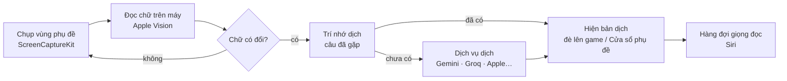

# OverSub

**Phụ đề tiếng Việt, giọng đọc và dịch màn hình cho mọi game trên Mac.**

OverSub đọc chữ trong game ngay trên màn hình, dịch bằng AI và hiện bản dịch đè đúng chỗ chữ gốc, đọc to lời thoại bằng giọng Siri, dịch tại chỗ cả menu và bảng nhiệm vụ.

**Tiếng Việt** · [English](README.en.md)

---

## Mục lục

- [OverSub làm được gì](#oversub-làm-được-gì)
- [Yêu cầu](#yêu-cầu)
- [Cài đặt](#cài-đặt)
- [Bắt đầu trong 5 phút](#bắt-đầu-trong-5-phút)
- [Hướng dẫn chi tiết](#hướng-dẫn-chi-tiết)
- [Dịch vụ dịch và key API](#dịch-vụ-dịch-và-key-api)
- [Phím tắt và tay cầm](#phím-tắt-và-tay-cầm)
- [Cơ chế hoạt động](#cơ-chế-hoạt-động)
- [Quyền riêng tư và dữ liệu](#quyền-riêng-tư-và-dữ-liệu)
- [Câu hỏi thường gặp và xử lý sự cố](#câu-hỏi-thường-gặp-và-xử-lý-sự-cố)
- [Giới hạn hiện tại](#giới-hạn-hiện-tại)
- [Góp ý và báo lỗi](#góp-ý-và-báo-lỗi)
- [Bản quyền](#bản-quyền)

---

## OverSub làm được gì

OverSub dùng được với **mọi game hiện trên màn hình Mac**: game Mac, game Windows chạy qua CrossOver hay Whisky, game đám mây, hay máy console (Switch, PlayStation…) chơi qua capture card và app xem hình như OBS, VisionRelay. App không can thiệp vào game, chỉ nhìn màn hình như bạn.

Ba tính năng chính, bật tắt độc lập bằng ba nút tròn ở cửa sổ chính:

| | Tính năng | Làm gì |
|---|---|---|
| 💬 | **Phụ đề** | Đọc lời thoại trong vùng bạn chọn, dịch và hiện bản dịch đè đúng chỗ phụ đề gốc: cùng vị trí, cùng màu chữ, cùng căn lề. Hoặc xem trong **Cửa sổ phụ đề** riêng. |
| 🔊 | **Voice-over / Dub** | Đọc to lời thoại đã dịch. *Voice-over*: một giọng Siri cho mọi câu. *Dub (beta)*: mỗi nhân vật một giọng theo giới tính và tuổi. Giọng lên xuống theo cảm xúc của câu và tự đọc nhanh hơn khi thoại dồn dập. |
| 🖼️ | **Dịch màn hình** | Dịch ngay tại chỗ chữ ngoài lời thoại: menu, bảng nhiệm vụ, mô tả vật phẩm, thư từ. Chữ gốc được xoá bằng cách dựng lại nền game, chữ dịch cùng màu và nằm gọn trong khung. Tối đa 3 vùng. |

Và còn:

- **Dịch nhanh** (⌃⌥Q): bấm phím tắt ở bất cứ đâu, kéo một khung quanh chữ, thả chuột là có bản dịch ngay tại chỗ. Có nút chép chữ gốc để tra cứu.
- **Cửa sổ phụ đề**: cửa sổ nổi chỉ có câu thoại, ghim trên mọi Space (kể cả game toàn màn hình), thu còn một dải mỏng để không che game, chữ sáng dần theo giọng đọc.
- **Nhiều dịch vụ dịch**: Gemini, Groq, Cerebras, Mistral, OpenRouter (có gói miễn phí), dịch vụ trả phí kiểu OpenAI (OpenAI, DeepSeek, xAI…), và hai engine của Apple chạy ngay trên máy, không cần mạng. App tự đo tốc độ, tự đổi sang dịch vụ khác khi một dịch vụ chậm hay hết hạn mức.
- **Dịch đúng giọng game**: chọn thể loại (Trung cổ châu Âu, Cổ trang kiếm hiệp, Anime/JRPG, Đường phố…) để AI chọn xưng hô và văn phong phù hợp, hoặc tự mô tả bối cảnh ở thể loại *Tuỳ chỉnh*. Giữ xưng hô nhất quán theo từng nhân vật, giữ nguyên tên riêng, có từ điển thuật ngữ.
- **Hồ sơ game**: mỗi game một bộ cài đặt (vùng chọn, giọng, thể loại, thuật ngữ, trí nhớ dịch), tự chuyển khi bạn mở game.
- **Phím tắt toàn cục** dùng được khi game toàn màn hình (đổi được), và **điều khiển bằng tay cầm**.
- Giao diện **tiếng Việt và tiếng Anh**. Dịch sang 12 ngôn ngữ; tiếng Việt có bộ hướng dẫn riêng về xưng hô và văn phong.

 
Cửa sổ phụ đề, đang rê chuột nên hiện các nút điều khiển

---

## Yêu cầu

- **macOS 26 trở lên**, **máy Mac chip Apple** (M1 trở lên).
- **Quyền Ghi màn hình** (macOS hỏi ở lần đầu).
- Nên có **key API miễn phí** của Gemini hoặc Groq để có bản dịch hay nhất. Không có key thì app vẫn dịch bằng Dịch máy Apple và Apple Intelligence (nếu máy bạn bật Apple Intelligence).
- Để giọng đọc tiếng Việt tự nhiên: tải **giọng Siri tiếng Việt** trong Cài đặt hệ thống. App có bảng hướng dẫn từng bước đi kèm.

## Cài đặt

1. Vào trang [**Releases**](https://github.com/imhillxtz/oversub-mac/releases/latest), tải file `OverSub-x.y.z.dmg`.
2. Mở file `.dmg`, kéo **OverSub** vào thư mục **Applications**.
3. Mở OverSub. Lần đầu macOS sẽ chặn vì app chưa được Apple công chứng (notarize). Đây là bước bình thường với app chia sẻ ngoài App Store khi tác giả chưa có tài khoản nhà phát triển trả phí của Apple.
   - Vào **Cài đặt hệ thống → Quyền riêng tư & Bảo mật**, kéo xuống dưới, bấm **Vẫn mở** (*Open Anyway*) cạnh dòng OverSub, rồi xác nhận.
4. Làm theo hướng dẫn trong app. Sau khi cấp **quyền Ghi màn hình**, hãy **thoát hẳn OverSub (⌘Q) rồi mở lại** để quyền có hiệu lực.

> Cập nhật bản mới: tải `.dmg` mới, kéo đè vào Applications. Cài đặt, key và hồ sơ game được giữ nguyên.

---

## Bắt đầu trong 5 phút

1. **Làm theo hướng dẫn lần đầu** (5 bước): cấp quyền, chọn ngôn ngữ trong game và ngôn ngữ dịch sang, chọn tính năng, cài giọng Siri, chọn vùng.
2. **Thêm key miễn phí** (khuyên dùng): lấy key ở [Google AI Studio](https://aistudio.google.com/apikey) hoặc [Groq](https://console.groq.com/keys), rồi vào **Cài đặt → Dịch vụ dịch**, dán key, bấm **Kiểm tra & thêm**. App chỉ thêm key chạy được.
3. **Chọn vùng phụ đề**: mở game tới một đoạn có lời thoại, bấm **Chọn vùng phụ đề** (⌘K, hoặc ⌃⌥K ngay trong game), kéo một khung bao quanh chỗ phụ đề hiện ra. Nên bao cả **nhãn tên nhân vật** nếu game có. Bấm **Xong**, xem lại chữ đọc được, rồi **Lưu**.
4. **Bấm Bắt đầu** (⌘R, hoặc ⌃⌥S trong game).
5. Bật tắt **Phụ đề**, **Voice-over**, **Dịch màn hình** bằng ba nút tròn tuỳ ý.

---

## Hướng dẫn chi tiết

### Chọn vùng

Trình chọn vùng mở ra là **xem trực tiếp** màn hình. Bấm **Dừng hình** (hoặc phím Space) để chọn trên ảnh đứng yên khi phụ đề hiện quá nhanh.

- **Vùng phụ đề** (một vùng): nơi lời thoại hiện ra. Có nút **Tự tìm phụ đề**.
- **Vùng dịch màn hình** (tối đa 3): quanh menu, bảng nhiệm vụ, ô mô tả vật phẩm. Bấm **Thêm vùng dịch** ở thanh công cụ.
- Kéo để di chuyển, kéo góc để đổi cỡ, phím Delete để xoá vùng. Bấm **Xong** (Enter) để xem lại chữ đọc được ở mọi vùng, rồi **Lưu** hoặc **Lưu & bắt đầu**.
- Hai vùng chồng nhau thì phụ đề được ưu tiên, không có hai lớp bản dịch đè nhau.

### Cách bắt thoại

Ở **Cài đặt → Phụ đề**, chọn theo cách game hiện chữ:

| Chế độ | Hợp với |
|---|---|
| **Chữ chạy** | Game hiện từng chữ như đánh máy (rất nhiều RPG). App dịch dần từng cụm đã hiện xong, đọc ngay khi đủ câu, không chờ hết đoạn. Cũng xử lý tốt cắt cảnh đổi phụ đề nhanh. |
| **Cân bằng** | Phụ đề hiện cả câu một lần. Dịch sau hai lần đọc giống nhau. |
| **Chờ đủ câu** | Chữ thay đổi liên tục, cần chờ thật ổn định mới dịch. |

### Phụ đề đè lên game và Cửa sổ phụ đề

- **Phụ đề đè lên game**: bản dịch phủ đúng lên phụ đề gốc. Ở **Cài đặt → Phụ đề**: kiểu nền, cỡ chữ, căn lề, dời vị trí, hiện kèm câu gốc.
- **Cửa sổ phụ đề** (⌘J): một cửa sổ nổi riêng, hợp khi chơi trên màn hình thứ hai hoặc muốn giữ nguyên hình game. Rê chuột vào để hiện nút:
  - mép trái: **Bắt đầu / Dừng** và **Bỏ qua câu này**;
  - mép phải: **Ghim** (nổi trên mọi Space, kể cả game toàn màn hình; mở lên là ghim sẵn), **Một dòng** (thu còn một dải chữ mỏng, đặt vừa vào dải đen dưới game), **Nền** (độ mờ kính, độ tối), **A− / A+**.

 
Chế độ một dòng: tên nhân vật đứng trước câu, câu dài tự co cho vừa

### Giọng đọc

- **Voice-over**: một giọng Siri đọc mọi câu, nhanh và đồng nhất. Giọng chỉ đọc **lời thoại trong vùng phụ đề**, không đọc chữ ở vùng dịch màn hình.
- **Dub (beta)**: mỗi nhân vật (nhận từ nhãn tên trên hộp thoại) một giọng theo giới tính và tuổi; quái vật và robot có giọng riêng. Danh sách nhân vật và giọng ở **Cài đặt → Nhân vật** (hiện khi chọn Dub).
- **Giọng Siri tiếng Việt**: macOS chỉ cho app khác dùng giọng Siri bạn đã chọn trong **Cài đặt hệ thống → Trợ năng → Nội dung được đọc**. Bấm **Đổi giọng Siri…** trong app (ở **Cài đặt → Giọng đọc** hoặc bước Giọng Siri của hướng dẫn lần đầu): một bảng hướng dẫn sẽ đi kèm cửa sổ Cài đặt hệ thống và tự đánh dấu từng bước khi bạn làm xong.
- **Nhịp đọc**: tự cân tốc độ theo nhịp thoại, bỏ câu đã trễ quá xa để giọng luôn bám theo màn hình, đọc theo cảm xúc (câu hét hay phấn khích đọc nhanh hơn, câu ngập ngừng hay buồn đọc chậm và nhỏ hơn).
- **Âm thanh**: chọn loa hoặc tai nghe riêng cho giọng đọc; tuỳ chọn tự giảm tiếng game khi đang đọc.
- Đọc lại câu vừa rồi: ⌃⌥R.

 

### Dịch màn hình

Dịch tại chỗ chữ trên giao diện game. Mỗi cụm chữ (mục menu, nút, đoạn mô tả) được thay riêng: chữ gốc xoá bằng cách dựng lại nền từ điểm ảnh xung quanh, chữ dịch cùng màu, cỡ chữ ước theo chữ gốc, luôn nằm gọn trong khung.

- Ba chế độ tốc độ: **Tức thì** (Dịch máy Apple), **Tức thì rồi chuốt bằng AI** (mặc định), **Chờ bản AI**.
- Chữ đã gặp được nhớ lại, hiện ngay không tốn lượt. Dòng có số như "Gold 120" được nhớ thành mẫu, số đổi thì điền lại.
- Tên riêng, nhãn hiệu, ký hiệu nút (A, B, ZL…) được giữ nguyên.

 

### Dịch nhanh

Bấm **⌃⌥Q** ở bất cứ đâu (không cần bấm Bắt đầu), kéo một khung quanh chữ, thả chuột là bản dịch hiện ngay tại chỗ. Dưới khung có ba nút: **xem dạng chữ** (có nút chép bản dịch), **chép chữ gốc**, **đóng**. Phím: ⌘C chép chữ gốc, ⇧⌘C chép bản dịch, Esc để thoát. Mặc định dừng hình lúc chọn, tắt được ở **Cài đặt → Dịch màn hình**.

### Văn phong, xưng hô và tên riêng

- **Thể loại game** quyết định cách xưng hô và giọng văn: ví dụ Trung cổ châu Âu dùng "thưa ngài", "ta – ngươi" theo địa vị; Cổ trang dùng "tại hạ – các hạ"; Học đường dùng "tớ – cậu".
- **Tuỳ chỉnh**: tự điền bối cảnh game, nhân vật và quan hệ, cách xưng hô, giọng văn, mức trang trọng, từ chửi thề, kính ngữ và yêu cầu khác; xem trước đoạn hướng dẫn gửi cho AI.
- **Giữ xưng hô nhất quán**: app gửi kèm tên người nói và vài câu trước, nên mỗi cặp nhân vật giữ đúng một cách xưng hô.
- **Tên riêng và thuật ngữ**: tên nhân vật, địa danh, quái vật, chiêu thức giữ như bản gốc; thêm vào danh sách để giữ chắc chắn, hoặc đặt một cách dịch cố định.
- **Bỏ qua câu này**: khi app dịch nhầm logo hay chữ cố định trên màn hình, bấm nút có biểu tượng chữ kèm dấu × (ở cửa sổ chính, Cửa sổ phụ đề hoặc Lịch sử). Từ đó câu đó không được dịch hay đọc nữa.

 

### Hồ sơ game và lịch sử

- **Hồ sơ game** lưu mọi thứ cho từng game: vùng chọn, ngôn ngữ, giọng, thể loại, thuật ngữ, ngữ cảnh hội thoại và trí nhớ dịch. Mọi thay đổi tự lưu vào hồ sơ đang dùng. Mở game nào thì app tự chuyển sang hồ sơ của game đó; game console chơi qua app xem capture card thì chọn hồ sơ bằng tay.
- **Lịch sử thoại** (⌘L, hoặc ⌃⌥L trong game): xem lại các câu vừa qua khi lỡ đọc không kịp, đọc lại, bỏ qua câu, giữ nguyên tên riêng.

---

## Dịch vụ dịch và key API

Thêm key ở **Cài đặt → Dịch vụ dịch**. Có thể thêm nhiều key và nhiều dịch vụ: hết hạn mức thì app tự chuyển sang key hoặc dịch vụ kế tiếp, dịch vụ chậm hay hay lỗi tự xuống cuối hàng.

| Dịch vụ | Chi phí | Ghi chú |
|---|---|---|
| **Gemini** | Miễn phí, có hạn mức | Dịch hay nhất trong nhóm miễn phí. Hạn mức tính **theo dự án Google Cloud**, không theo key: hai key cùng một dự án dùng chung hạn mức. Muốn dự phòng, hãy thêm key của dịch vụ khác. [Lấy key](https://aistudio.google.com/apikey) |
| **Groq** | Miễn phí, có hạn mức | Rất nhanh (khoảng 0,3–0,5 giây mỗi câu). [Lấy key](https://console.groq.com/keys) |
| **Cerebras** | Miễn phí, có hạn mức | Nhanh ngang Groq, hạn mức theo số chữ mỗi ngày. [Lấy key](https://cloud.cerebras.ai) |
| **Mistral** | Miễn phí, có hạn mức | Gói miễn phí rộng nhưng chỉ một lượt mỗi giây; hợp làm dự phòng. [Lấy key](https://console.mistral.ai/api-keys) |
| **OpenRouter** | Có model miễn phí | Một key dùng nhiều model; model miễn phí có tên kết thúc bằng `:free`. [Lấy key](https://openrouter.ai/keys) |
| **Dịch vụ tự thêm** | Trả phí theo lượng chữ | Mọi API kiểu OpenAI: OpenAI, DeepSeek, xAI (Grok), Together, Fireworks… Nhập địa chỉ, tên model và key. |
| **Apple Intelligence** | Miễn phí, trên máy | Không cần mạng; cần máy đã bật Apple Intelligence. |
| **Dịch máy Apple** | Miễn phí, trên máy | Nhanh nhất, không cần mạng; không nhận chỉ dẫn về xưng hô. Cần tải gói ngôn ngữ (app có nút tải). |

> Hạn mức miễn phí do nhà cung cấp quyết định và thay đổi theo thời gian; số liệu chính xác cho tài khoản của bạn xem ở trang của nhà cung cấp.

**Thứ tự ưu tiên**: *Cân bằng* (mặc định), *Ưu tiên chất lượng*, *Ưu tiên tốc độ* hoặc *Tuỳ chỉnh* (tự sắp xếp). App đo tốc độ thật của từng dịch vụ (trung vị 20 lần gần nhất, có trừ điểm khi hay lỗi) để tự xếp hàng. Khi dịch vụ đầu chưa trả lời sau 1 giây, app gửi song song cho dịch vụ kế tiếp và lấy kết quả về trước.

---

## Phím tắt và tay cầm

Phím tắt toàn cục dùng được cả khi game đang toàn màn hình, không cần quyền Trợ năng. **Đổi được** ở **Cài đặt → Phím tắt & tay cầm**: bấm vào ô phím tắt rồi gõ tổ hợp mới.

| Phím mặc định | Việc |
|---|---|
| ⌃⌥S | Bắt đầu / Dừng |
| ⌃⌥H | Ẩn / hiện phụ đề đè lên game |
| ⌃⌥D | Bật / tắt giọng đọc |
| ⌃⌥R | Đọc lại câu vừa rồi |
| ⌃⌥T | Bật / tắt dịch màn hình |
| ⌃⌥Q | Dịch nhanh một vùng |
| ⌃⌥K | Chọn vùng phụ đề |
| ⌃⌥L | Lịch sử thoại |

Trong cửa sổ OverSub: ⌘R bắt đầu/dừng, ⌘K chọn vùng, ⌘J Cửa sổ phụ đề, ⌘E dịch nhanh, ⌘L lịch sử, ⇧⌘H phụ đề, ⇧⌘D giọng đọc, ⇧⌘T dịch màn hình.

**Tay cầm** (Xbox, PlayStation, Switch Pro…): giữ nút **View / Share** rồi bấm **Y (△)** để đọc lại câu vừa rồi, **X (□)** để bật tắt giọng đọc, **B (○)** để ẩn hiện phụ đề.

Biểu tượng tay cầm trên thanh menu cũng điều khiển được mọi thứ mà không cần mở cửa sổ.

---

## Cơ chế hoạt động

- **Chụp màn hình** bằng ScreenCaptureKit, *loại trừ chính OverSub*: lớp bản dịch vừa hiện không bao giờ bị chụp lại và đọc ngược.
- **Đọc chữ hoàn toàn trên máy** bằng Apple Vision. Mỗi nhịp, app đọc nhanh (khoảng 14 ms) để biết chữ có đổi không; chỉ khi khác mới đọc kỹ (khoảng 120 ms). Cảnh nền chuyển động không làm đọc lại liên tục.
- **Tách nhãn tên người nói** khỏi câu thoại dựa vào cỡ và màu chữ khác hẳn dòng dưới; nhớ các tên đã gặp để nhận ra cả khi tên dính vào đầu câu.
- **Chữ chạy**: dịch từng cụm đã hiện xong (đến dấu phẩy, dấu chấm, hoặc đủ vài từ), các cụm cùng câu dịch nối tiếp để giữ ngữ cảnh. Việc dịch chạy riêng nên vòng quét không bao giờ phải chờ AI, không bỏ lỡ khung phụ đề ở cắt cảnh.
- **Dịch**: trước hết tra trí nhớ dịch của hồ sơ game; chưa có thì gửi câu kèm vài câu trước, tên người nói, thể loại và thuật ngữ cho dịch vụ đứng đầu; dịch vụ đó chậm thì gửi song song cho dịch vụ kế tiếp. Tên riêng được thay bằng mã tạm trước khi gửi để AI không dịch mất.
- **Giọng đọc** xếp hàng, không cắt câu đang đọc; câu chờ quá lâu mà đã có câu mới hơn thì bỏ để giọng luôn bám màn hình; cùng một câu không bị đọc lặp khi OCR đọc chập chờn hay khi bạn chuyển app rồi quay lại.
- **Dịch màn hình** nhận biết chữ đổi bằng nội dung chữ (không theo điểm ảnh), dựng lại nền chỗ chữ gốc trong khoảng 10 ms, nén ngang nhẹ trước khi giảm cỡ chữ để bản dịch nằm gọn trong khung.

Chi tiết kỹ thuật: [Docs/DEVELOPMENT.md](Docs/DEVELOPMENT.md).

---

## Quyền riêng tư và dữ liệu

- **Ảnh màn hình không rời khỏi máy.** Việc đọc chữ chạy hoàn toàn trên Mac của bạn.
- Khi dùng dịch vụ dịch qua mạng, **chỉ chữ** được gửi tới đúng dịch vụ bạn chọn: câu cần dịch, vài câu trước làm ngữ cảnh và tên nhân vật. Dùng Dịch máy Apple hay Apple Intelligence thì không có gì được gửi ra ngoài.
- OverSub **không có máy chủ riêng**, không thu thập thống kê, không quảng cáo.
- **Key API** lưu trong `~/Library/Application Support/OverSub/keys.json`, chỉ tài khoản người dùng của bạn đọc được (quyền 0600).
- Dữ liệu app: hồ sơ, ngữ cảnh và trí nhớ dịch ở `~/Library/Application Support/OverSub`. Nhật ký chẩn đoán ở `~/Library/Logs/OverSub/debug.log`; nhật ký có chứa chữ đọc được trong game, xoá được bất cứ lúc nào.

---

## Câu hỏi thường gặp và xử lý sự cố

<b>macOS không cho mở OverSub</b>

App chưa được Apple công chứng nên lần đầu bị chặn. Vào **Cài đặt hệ thống → Quyền riêng tư & Bảo mật**, kéo xuống, bấm **Vẫn mở** cạnh dòng OverSub.

<b>Đã cấp quyền Ghi màn hình mà app vẫn báo thiếu quyền</b>

macOS chỉ áp dụng quyền mới sau khi app khởi động lại. Thoát hẳn OverSub (⌘Q, hoặc biểu tượng tay cầm trên thanh menu → Thoát) rồi mở lại.

<b>Giọng đọc không phải giọng Siri tiếng Việt</b>

Vào **Cài đặt → Giọng đọc**, bấm **Đổi giọng Siri…** và làm theo bảng hướng dẫn: tải giọng Siri tiếng Việt và chọn nó trong *Nội dung được đọc* của Cài đặt hệ thống.

<b>Dịch chậm, hoặc bỗng chuyển sang bản dịch máy</b>

Thường là key đã hết hạn mức. Xem **Cài đặt → Dịch vụ dịch**: trạng thái từng key (còn bao lâu dùng lại) và nhật ký chuyển dịch vụ. Thêm key của một dịch vụ khác (Groq, Cerebras…) để có dự phòng.

<b>App không nhận được phụ đề, hoặc đọc sai</b>

- Chọn lại vùng phụ đề cho vừa khít, nên bao cả nhãn tên nhân vật.
- Thử đổi **Cách bắt thoại** (game hiện từng chữ thì chọn *Chữ chạy*).
- Kiểm tra **Ngôn ngữ trong game** đúng với ngôn ngữ phụ đề.
- Nếu bật *Chỉ chạy khi game đang ở phía trước*, app tạm ngưng khi bạn chuyển sang app khác.

<b>App dịch nhầm logo, chữ cố định trên màn hình</b>

Bấm **Bỏ qua câu này** (biểu tượng chữ kèm dấu ×). Danh sách câu đã bỏ qua xem và xoá được ở **Cài đặt → Văn phong & thuật ngữ**.

<b>Dịch tên nhân vật ra tiếng Việt</b>

Bật **Giữ nguyên tên riêng** và thêm tên vào danh sách ở **Cài đặt → Văn phong & thuật ngữ**, hoặc bấm **Giữ nguyên tên riêng…** ở cửa sổ chính để chọn nhanh tên trong câu đang hiện.

---

## Giới hạn hiện tại

- Chỉ chạy trên **macOS 26 trở lên** và **máy chip Apple**.
- App **chưa được Apple công chứng**, nên lần đầu phải bấm *Vẫn mở*.
- Đọc chữ **tiếng Nhật, Hàn, Trung** chưa được kiểm chứng kỹ trên game thật.
- Vùng chọn lưu theo toạ độ màn hình: đổi độ phân giải hay đổi màn hình thì nên chọn lại.
- Dub dùng giọng Apple; giọng Gemini đang tạm tắt vì còn chậm (4–8 giây mỗi câu).
- Cerebras, Mistral, OpenRouter và dịch vụ tự thêm mới được kiểm phần kết nối, chưa thử dài trên game thật.

---

## Góp ý và báo lỗi

Mọi góp ý đều quý, nhất là từ người chơi các game khác nhau.

- **Báo lỗi hoặc đề xuất tính năng**: mở một [Issue](https://github.com/imhillxtz/oversub-mac/issues). Ghi kèm phiên bản OverSub (**Cài đặt → Chung**), tên game, cách game hiện phụ đề, và nếu được thì một đoạn nhật ký quanh lúc gặp lỗi (`~/Library/Logs/OverSub/debug.log`; hãy xem lại trước khi gửi vì nhật ký có chứa chữ trong game).
- **Báo game chạy tốt**: một Issue ngắn "game X chạy tốt với chế độ Y" cũng giúp người sau rất nhiều.
- **Đóng góp mã**: mã nguồn được công khai để mọi người xem, nhưng bản quyền vẫn được bảo lưu. Muốn đóng góp mã, hãy mở Issue trao đổi trước.

---

## Bản quyền

© 2026 imhillxtz. **Bảo lưu mọi quyền.**

Mã nguồn được công khai để mọi người xem và kiểm tra app làm gì trên máy họ. **Đây không phải phần mềm mã nguồn mở**: không được sao chép, sửa đổi, phát hành lại hay dùng cho mục đích thương mại khi chưa có sự đồng ý bằng văn bản của tác giả. Bản cài chính thức ở trang Releases được dùng miễn phí. Xem [LICENSE](LICENSE).

Tên game và nhãn hiệu nhắc tới trong tài liệu thuộc về chủ sở hữu tương ứng. OverSub dùng các dịch vụ và công nghệ của Apple, Google, Groq, Cerebras, Mistral và OpenRouter theo điều khoản của từng nhà cung cấp.
