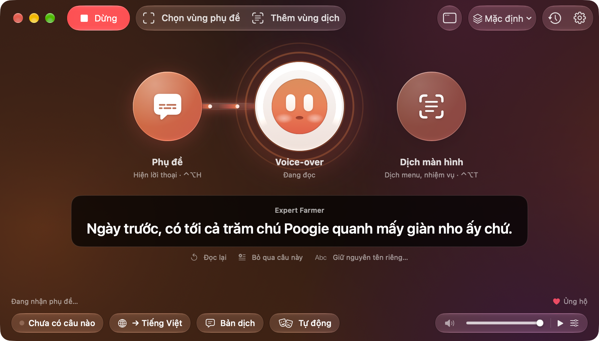
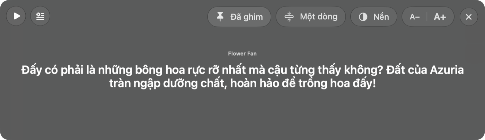
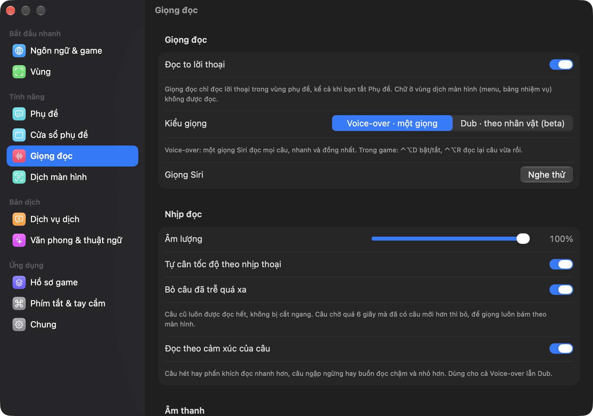
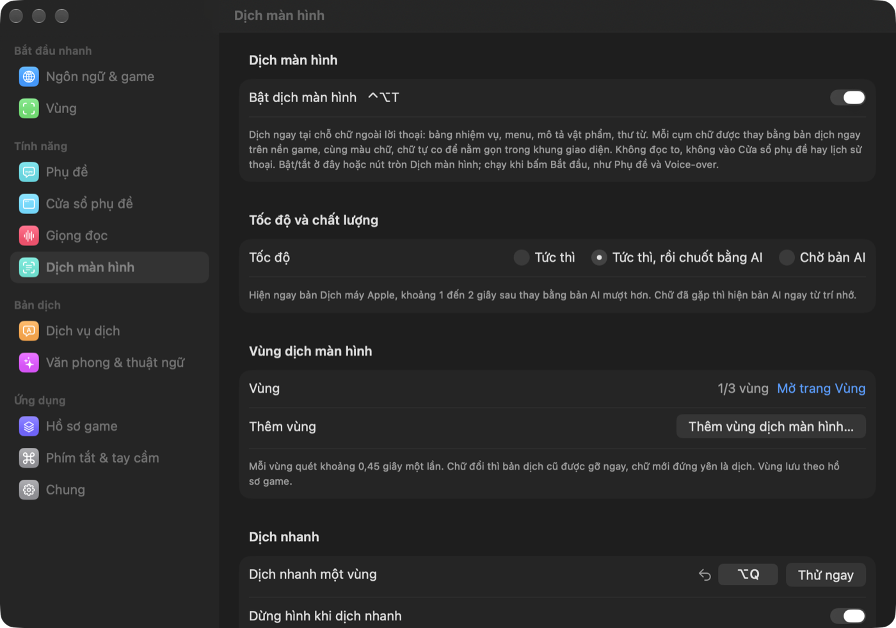
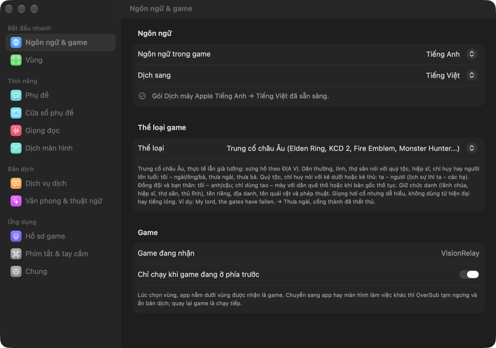
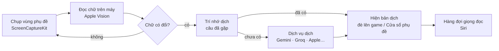

# OverSub

Phụ đề tiếng Việt, giọng đọc và dịch màn hình cho mọi game trên Mac.

OverSub đọc chữ trong game trên màn hình, dịch bằng AI rồi hiện bản dịch đè đúng chỗ chữ gốc. App đọc to lời thoại bằng giọng Siri và dịch tại chỗ cả menu, bảng nhiệm vụ.

Tiếng Việt · [English](README.en.md)

## Mục lục

- [OverSub làm được gì](#oversub-làm-được-gì)
- [Yêu cầu](#yêu-cầu)
- [Cài đặt](#cài-đặt)
- [Bắt đầu trong 5 phút](#bắt-đầu-trong-5-phút)
- [Hướng dẫn chi tiết](#hướng-dẫn-chi-tiết)
- [Dịch vụ dịch và key API](#dịch-vụ-dịch-và-key-api)
- [Phím tắt và tay cầm](#phím-tắt-và-tay-cầm)
- [Cơ chế hoạt động](#cơ-chế-hoạt-động)
- [Quyền riêng tư và dữ liệu](#quyền-riêng-tư-và-dữ-liệu)
- [Câu hỏi thường gặp và xử lý sự cố](#câu-hỏi-thường-gặp-và-xử-lý-sự-cố)
- [Giới hạn hiện tại](#giới-hạn-hiện-tại)
- [Góp ý và báo lỗi](#góp-ý-và-báo-lỗi)
- [Ủng hộ](#ủng-hộ)
- [Bản quyền](#bản-quyền)

## OverSub làm được gì

OverSub dùng được với mọi game hiện trên màn hình Mac: game Mac, game Windows chạy qua CrossOver hay Whisky, game đám mây, và máy console (Switch, PlayStation) chơi qua capture card, xem ngay trong Màn hình chơi game của OverSub hoặc bằng app xem hình như OBS. App không can thiệp vào game, nó chỉ nhìn màn hình như bạn.

Cửa sổ chính có ba nút bật tắt riêng: Phụ đề bên trái, Ove ở giữa (linh vật 3D của OverSub, cũng là nút giọng đọc), Dịch màn hình bên phải. Ove nhìn theo chuột; đang đọc thì Ove mấp máy miệng và câu thoại hiện trong bong bóng kính của Ove; tắt giọng đọc thì Ove ngáp rồi ngủ. Đặt chuột lên đầu là Ove vui, rung chuột thật nhanh trên đầu là Ove giận.

https://github.com/user-attachments/assets/db2bf69f-3bb9-4343-82d8-905128e31e92

Cửa sổ chính với ba nút Phụ đề, Voice-over và Dịch màn hình. Khi OverSub đang đọc thoại, Ove ở giữa mấp máy miệng.

| Tính năng | Làm gì |
|---|---|
| Phụ đề | Đọc lời thoại trong vùng bạn chọn, dịch rồi hiện bản dịch đè đúng chỗ phụ đề gốc, cùng vị trí, màu chữ và căn lề. Có thể xem trong Cửa sổ phụ đề riêng thay vì đè lên game. |
| Voice-over / Dub | Đọc to lời thoại đã dịch. Voice-over dùng một giọng Siri cho mọi câu. Dub (beta) cho mỗi nhân vật một giọng theo giới tính và tuổi. Giọng nhanh chậm theo cảm xúc của câu và đọc nhanh hơn khi thoại dồn dập. |
| Dịch màn hình | Dịch tại chỗ chữ ngoài lời thoại như menu, bảng nhiệm vụ, mô tả vật phẩm, thư từ. App xoá chữ gốc bằng cách dựng lại nền game, chữ dịch cùng màu và nằm gọn trong khung. Tối đa 3 vùng. |

Các tính năng khác:

- Dịch nhanh (⌃⌥Q): bấm phím tắt ở đâu cũng được, kéo khung quanh chữ, thả chuột là có bản dịch tại chỗ. Có nút chép bản dịch và nút xem chữ gốc để tra cứu.
- Màn hình chơi game: cắm capture card là chân cửa sổ chính báo tên card kèm nút mở. Hình và tiếng của máy console hiện trong một cửa sổ của OverSub, không cần app xem hình riêng; phụ đề, giọng đọc và dịch màn hình chạy trên cửa sổ này như với mọi game.
- Cửa sổ phụ đề: cửa sổ nổi chỉ có câu thoại, ghim trên mọi Space kể cả khi game toàn màn hình. Thu được còn một dải mỏng để không che game, chữ sáng dần theo giọng đọc.
- Dịch vụ dịch: Gemini, Groq, Cerebras, Mistral, OpenRouter (đều có gói miễn phí), dịch vụ trả phí kiểu OpenAI (OpenAI, DeepSeek, xAI), và hai engine của Apple chạy trên máy không cần mạng. App đo tốc độ từng dịch vụ và đổi sang dịch vụ khác khi một dịch vụ chậm hay hết hạn mức.
- Thể loại game: chọn Trung cổ châu Âu, Cổ trang kiếm hiệp, Anime/JRPG, Đường phố... để AI chọn xưng hô và văn phong, hoặc tự mô tả bối cảnh ở thể loại Tuỳ chỉnh. Xưng hô giữ nhất quán theo từng cặp nhân vật, tên riêng giữ nguyên, có từ điển thuật ngữ.
- Hồ sơ game: mỗi game một bộ cài đặt (vùng chọn, giọng, thể loại, thuật ngữ, trí nhớ dịch). Mở game nào thì app chuyển sang hồ sơ của game đó.
- Phím tắt toàn cục dùng được khi game toàn màn hình và đổi được. Điều khiển được bằng tay cầm.
- Giao diện tiếng Việt và tiếng Anh. Dịch sang 12 ngôn ngữ; riêng tiếng Việt có hướng dẫn xưng hô và văn phong cho AI.

 
Cửa sổ phụ đề, đang rê chuột nên hiện các nút điều khiển

## Yêu cầu

- macOS 26 trở lên, máy Mac chip Apple (M1 trở lên).
- Quyền Ghi màn hình. macOS hỏi ở lần mở đầu tiên.
- Nếu dùng Màn hình chơi game: quyền Camera (macOS xếp capture card vào nhóm camera) và quyền Micrô (tiếng game từ card vào Mac theo đường micrô). macOS hỏi ở lần mở màn hình chơi đầu tiên.
- Bạn nên lấy thêm key API miễn phí của Gemini hoặc Groq để có bản dịch hay nhất. Chưa có key thì app vẫn dịch được bằng Dịch máy Apple và Apple Intelligence (nếu máy bạn đã bật Apple Intelligence).
- Để giọng đọc tiếng Việt nghe tự nhiên, bạn nên tải giọng Siri tiếng Việt trong Cài đặt hệ thống. App có bảng hướng dẫn từng bước.

## Cài đặt

1. Vào trang [Releases](https://github.com/imhillxtz/oversub-mac/releases/latest), tải file `OverSub-x.y.z.dmg`.
2. Mở file `.dmg`, kéo OverSub vào thư mục Applications.
3. Mở OverSub. Lần đầu macOS sẽ chặn vì app chưa được Apple công chứng (notarize). OverSub được phát hành ngoài App Store và chưa có tài khoản nhà phát triển trả phí của Apple nên chưa thể công chứng; mọi app trong trường hợp này đều bị chặn như vậy. Mã nguồn được công khai tại đây để bạn có thể tự kiểm tra. Vào Cài đặt hệ thống → Quyền riêng tư & Bảo mật, kéo xuống dưới, bấm **Vẫn mở** (Open Anyway) cạnh dòng OverSub rồi xác nhận.
4. Làm theo hướng dẫn trong app. Sau khi cấp quyền Ghi màn hình, thoát hẳn OverSub (⌘Q) rồi mở lại để quyền có hiệu lực.

### Cập nhật

Từ bản 1.1.42, OverSub tự kiểm tra bản mới trên trang Releases, khoảng hai lần mỗi ngày. Khi có bản mới, dòng trạng thái ở chân cửa sổ chính hiện "Có bản mới · Cập nhật". Bấm Cập nhật là app tải về, kiểm tra chữ ký số, thay bản cũ rồi tự mở lại. Bấm "Có gì mới" ở dòng đó, hoặc chọn OverSub → Kiểm tra cập nhật… trên thanh menu, để mở hộp thoại cập nhật: hộp thoại liệt kê thay đổi của mọi bản kể từ bản bạn đang dùng, có nút Cập nhật, Để sau và Bỏ qua bản này. Nếu không muốn bị gián đoạn lúc đang chơi, hãy bật "Tự tải bản mới và cài khi thoát app" ở Cài đặt → Chung; bản mới sẽ được thay vào lúc bạn thoát OverSub. Cài đặt, key, hồ sơ game và quyền Ghi màn hình đều giữ nguyên.

Bản 1.1.41 trở về trước chưa có tính năng này. Nếu đang dùng các bản này, hãy tải `.dmg` mới và kéo đè vào Applications một lần; các bản sau sẽ tự cập nhật.

## Bắt đầu trong 5 phút

1. Làm theo hướng dẫn lần đầu (5 bước): cấp quyền, chọn ngôn ngữ trong game và ngôn ngữ dịch sang, chọn tính năng, cài giọng Siri, chọn vùng.
2. Thêm key miễn phí (khuyên dùng): lấy key ở [Google AI Studio](https://aistudio.google.com/apikey) hoặc [Groq](https://console.groq.com/keys), vào Cài đặt → Dịch vụ dịch, dán key và bấm Kiểm tra & thêm. App sẽ thử key trước và chỉ thêm khi key dùng được.
3. Thêm vùng phụ đề: mở game tới đoạn có lời thoại, bấm Thêm vùng phụ đề (⌘K, hoặc ⌃⌥K ngay trong game), kéo khung bao quanh chỗ phụ đề hiện ra. Nếu game có nhãn tên nhân vật, bạn nên bao cả nhãn đó. Bấm Xong, xem lại chữ đọc được rồi bấm Lưu.
4. Bấm Bắt đầu (⌘R, hoặc ⌃⌥S trong game).
5. Bật hoặc tắt Phụ đề, Voice-over (bấm vào Ove ở giữa) và Dịch màn hình tuỳ nhu cầu.

## Hướng dẫn chi tiết

Các mục dưới đây đi theo thứ tự bạn sẽ gặp: chọn vùng, chọn cách bắt thoại, rồi chỉnh phụ đề, giọng đọc và văn phong.

### Chọn vùng

Trình chọn vùng mở ra là hình trực tiếp của màn hình. Nếu phụ đề hiện quá nhanh, hãy bấm Dừng hình (hoặc phím Space) để chọn trên ảnh đứng yên.

 
Hình đang dừng nên có thể chọn thong thả. Kéo khung quanh hộp thoại và bao cả nhãn tên nhân vật.

Vùng phụ đề (chỉ một vùng) là nơi lời thoại hiện ra; nút Tự tìm phụ đề sẽ đoán chỗ đó giúp bạn. Vùng dịch màn hình (tối đa 3) đặt quanh menu, bảng nhiệm vụ hay ô mô tả vật phẩm, thêm bằng nút Thêm vùng dịch trên thanh công cụ. Khi đã có vùng, hai nút đổi thành Chỉnh vùng phụ đề và Chỉnh vùng dịch (kèm số vùng, ví dụ 2/3) để di chuyển, đổi cỡ, xoá hay thêm vùng.

Kéo để di chuyển, kéo góc để đổi cỡ, phím Delete để xoá vùng. Bấm Xong (Enter) để xem lại chữ đọc được ở mọi vùng, rồi Lưu hoặc Lưu & bắt đầu. Nếu hai vùng chồng lên nhau, vùng phụ đề được ưu tiên, nên sẽ không có hai lớp bản dịch đè nhau.

 
Sau khi bấm Xong, OverSub liệt kê chữ đọc được trong từng vùng để bạn kiểm tra trước khi Lưu hoặc Lưu &amp; bắt đầu.

 
Cài đặt → Vùng giữ ảnh xem trước của hồ sơ game: viền trắng là vùng phụ đề, viền cam là vùng dịch màn hình.

### Cách bắt thoại

Chọn ở Cài đặt → Phụ đề, theo cách game hiện chữ:

| Chế độ | Hợp với |
|---|---|
| Chữ chạy | Game hiện từng chữ như đánh máy (rất nhiều RPG). App dịch dần từng cụm đã hiện xong và đọc ngay khi đủ câu, không chờ hết đoạn. Cắt cảnh đổi phụ đề nhanh cũng không bị lỡ khung. |
| Cân bằng | Phụ đề hiện cả câu một lần. App dịch sau hai lần đọc ra cùng một chữ. |
| Chờ đủ câu | Chữ thay đổi liên tục, phải chờ thật ổn định mới dịch. |

### Phụ đề đè lên game và Cửa sổ phụ đề

Phụ đề đè lên game phủ bản dịch đúng lên phụ đề gốc. Kiểu nền, cỡ chữ, căn lề, vị trí và việc hiện kèm câu gốc chỉnh ở Cài đặt → Phụ đề.

https://github.com/user-attachments/assets/d9f11e68-079e-46f8-95d4-c799093166b6

Bản dịch phủ đúng chỗ hộp thoại gốc. Câu thoại hiện ngoài hộp, ở góc trái màn hình, được dịch tại chỗ bằng một vùng Dịch màn hình.

Cửa sổ phụ đề (⌘J) là một cửa sổ nổi riêng, hợp khi chơi trên màn hình thứ hai hoặc khi muốn giữ nguyên hình game. Rê chuột vào cửa sổ để hiện các nút. Mép trái có Bắt đầu / Dừng và Bỏ qua câu này. Mép phải có Ghim (nổi trên mọi Space kể cả game toàn màn hình; mở lên là ghim sẵn), Một dòng (thu còn một dải chữ mỏng, vừa với dải đen dưới game), Nền (độ mờ kính, độ tối) và A− / A+.

https://github.com/user-attachments/assets/b125123e-f987-473b-ac57-f1a63830cd24

Cửa sổ phụ đề trên một đoạn phim dựng sẵn: bản dịch tiếng Việt nằm ở dải chữ dưới khung hình và được đọc thành tiếng khi từng câu hiện ra. Video có tiếng.

 
Chế độ một dòng: tên nhân vật đứng trước câu, câu dài tự co cho vừa

### Giọng đọc

Voice-over dùng một giọng Siri đọc mọi câu. Giọng chỉ đọc lời thoại trong vùng phụ đề, không đọc chữ ở vùng dịch màn hình.

Dub (beta) cho mỗi nhân vật một giọng theo giới tính và tuổi; app nhận nhân vật từ nhãn tên trên hộp thoại, quái vật và robot có giọng riêng. Danh sách nhân vật và giọng ở Cài đặt → Nhân vật (mục này chỉ hiện khi chọn Dub).

macOS chỉ cho app khác dùng giọng Siri bạn đã chọn trong Cài đặt hệ thống → Trợ năng → Nội dung được đọc. Bấm Đổi giọng Siri... trong app (ở Cài đặt → Giọng đọc, hoặc bước Giọng Siri của hướng dẫn lần đầu): một bảng hướng dẫn mở cạnh cửa sổ Cài đặt hệ thống và đánh dấu từng bước khi bạn làm xong.

Tốc độ đọc tự cân theo nhịp thoại. Nếu một câu đã trễ quá xa, app bỏ qua câu đó để giọng đọc theo kịp màn hình. Câu hét hay phấn khích đọc nhanh hơn, câu ngập ngừng hay buồn đọc chậm và nhỏ hơn. Giọng đọc có thể ra loa hoặc tai nghe riêng, và có tuỳ chọn tự giảm tiếng game khi đang đọc. Đọc lại câu vừa rồi: ⌃⌥R.

 

### Dịch màn hình

Dịch tại chỗ chữ trên giao diện game. Mỗi cụm chữ (mục menu, nút, đoạn mô tả) được thay riêng: app xoá chữ gốc bằng cách dựng lại nền từ các điểm ảnh xung quanh, chữ dịch cùng màu, cỡ chữ ước theo chữ gốc và luôn nằm trong khung.

Có ba chế độ tốc độ: Tức thì (Dịch máy Apple), Tức thì rồi chuốt bằng AI (mặc định) và Chờ bản AI. Chữ đã gặp thì hiện lại ngay, không tốn lượt. Dòng có số như "Gold 120" được nhớ thành mẫu, số đổi thì app chỉ điền lại số. Tên riêng, nhãn hiệu và ký hiệu nút (A, B, ZL) giữ nguyên.

 

### Dịch nhanh

Bấm ⌃⌥Q ở đâu cũng được (không cần bấm Bắt đầu), kéo khung quanh chữ, thả chuột là bản dịch hiện tại chỗ. Dưới khung có nút xem chữ gốc (kèm nút chép chữ gốc), nút chép bản dịch và nút đóng. Phím ⌘C chép bản dịch, ⇧⌘C chép chữ gốc, Esc để thoát. Mặc định màn hình dừng hình lúc bạn chọn; bạn có thể tắt ở Cài đặt → Dịch màn hình.

 
Dịch nhanh một đoạn chữ dài: bản dịch hiện tại chỗ, thanh nút bên dưới để xem chữ gốc, chép bản dịch và đóng.

### Màn hình chơi game

Cắm capture card vào Mac (lúc OverSub đang mở hay trước đó đều được), chân cửa sổ chính hiện dòng "Đã nhận tín hiệu từ" kèm tên card, độ phân giải, số khung hình và nút Mở màn hình chơi. App không tự mở cửa sổ. Không có dòng báo thì bấm Màn hình chơi game ở chân cửa sổ chính, hoặc mục cùng tên trong menu Window. Dòng báo không tính webcam và camera FaceTime; muốn dùng camera thì chọn trong mục Thiết bị hình.

https://github.com/user-attachments/assets/52e95177-6590-4198-8b09-fe6789814012

Chơi Switch qua capture card, quay từ màn hình TV: lời thoại của game được OverSub dịch và đọc thành tiếng Việt. Video có tiếng.

Cửa sổ mở ra là cửa sổ thường, nhớ vị trí và cỡ; nắm kéo hình để di chuyển cửa sổ, kéo mép để đổi cỡ. Bấm nút xanh, bấm đúp vào hình hoặc ⌃⌘F để toàn màn hình. Hình giữ đúng tỉ lệ, dư thì có viền đen. Tiếng phát thẳng ra loa. Rê chuột vào hình thì hiện thanh nhỏ ở chân cửa sổ: tắt tiếng, âm lượng, toàn màn hình và menu tuỳ chọn (bấm phải vào hình cũng mở menu này). Đóng cửa sổ là app thôi nhận hình và tiếng từ card.

Menu tuỳ chọn và trang Cài đặt → Màn hình chơi game có cùng các mục: chọn card, định dạng, nguồn tiếng, loa phát ra, dải màu, chuẩn màu, không gian màu, HDR, bộ chỉnh hình, khung hình (vừa khung hoặc lấp đầy), độ trễ, tắt tiếng khi chuyển sang app khác, luôn nằm trên cùng.

Bộ chỉnh hình gom sẵn cách phóng to, làm nét, khử răng cưa và tăng FPS. Capture card chỉ đưa ra hình đã vẽ xong, không có dữ liệu chuyển động hay chiều sâu của game, nên DLSS hay FSR 2 trở lên không dùng được; các bộ dưới đây đều làm việc trên hình hoàn chỉnh:

| Bộ | Làm gì | Trễ thêm, đo trên M1 Pro (tín hiệu 60 / 30 khung/giây) |
|---|---|---|
| Gốc | Không xử lý thêm, độ trễ thấp nhất | không |
| Nét | Phóng bằng FSR 1 của AMD rồi làm nét RCAS | 3 / 3 ms |
| Mịn cạnh | Khử răng cưa FXAA, rồi FSR 1 | 3 / 4 ms |
| Game 3D | Mạng AI Anime4K cho hình 3D, có khử răng cưa | 5 / 6 ms |
| Hình hoạt hình | Mạng AI Anime4K cho nét vẽ hoạt hình | 7 / 8 ms |
| Mượt 120 khung/giây (tín hiệu 30: Mượt 60) | Chèn một khung giữa mỗi hai khung thật: 60 lên 120 (cần màn 120 Hz), 30 lên 60 | 15 / 24 ms |
| Game 30 khung/giây lên 60 | Thay khung lặp của game 30 khung/giây bằng khung giữa; tín hiệu 30 khung/giây thì chèn như gấp đôi | 20 / 24 ms |

Trễ thêm là bấm nút trên tay cầm thì hình phản hồi chậm hơn chừng đó so với Gốc. App ghi số này ngay ở từng lựa chọn, tính theo tín hiệu, cỡ khung hình và thời gian GPU đo được trên chính máy bạn; bộ đang dùng có thêm số đo trực tiếp. Số càng lớn thì GPU càng nhiều việc, máy ấm và tốn pin hơn. Chỉnh từng mục (Phóng to, Làm nét, Khử răng cưa, Tăng FPS) thì bộ thành Tuỳ chỉnh, và mỗi mục ghi phần trễ riêng nó cộng vào. Khung chèn dựng từ hai khung thật bằng cách dò chuyển động trên hình, nên vật chạy nhanh có thể nhoè ở mép; chữ, thanh máu, bản đồ đứng yên vẫn giữ nguyên nét.

Hình giật hay tụt khung thì thường là GPU của máy đang bị app khác chiếm (iOS Simulator, app vẽ hoạt hình liên tục, xuất video): đóng bớt các app đó hoặc chọn bộ chỉnh hình nhẹ hơn. Nhật ký ghi mức bận GPU của cả máy mỗi 10 giây để tra lại.

Các đánh đổi khác cũng ghi ngay ở lựa chọn: định dạng 30 khung/giây (như 2560×1440 · 30 của nhiều card) kém mượt và trễ thêm khoảng 8 ms; YUV 4:2:2 giữ màu viền chữ rõ hơn còn 4:2:0 tốn ít CPU hơn; loa, tai nghe Bluetooth trễ tiếng thường hơn 0,1 giây; Display P3 rực hơn nhưng lệch màu gốc; Hiện HDR (EDR) chỉ còn phóng thường hoặc MetalFX; làm nét mạnh dễ lộ viền sáng; khử răng cưa làm mềm nhẹ chữ nhỏ.

Nếu màu trên Mac lệch so với TV, hãy xem mục Dải màu. Để Tự động thì app đọc độ sáng thật của tín hiệu, vì nhiều card ghi sai dải màu. Hình nhạt, màu đen ngả xám: chọn Giới hạn. Hình gắt, vùng tối mất chi tiết: chọn Đầy đủ. Vẫn nhạt dù đã chọn Giới hạn thì trên Switch 2 vào System Settings › Display › RGB Range và chọn Full Range. Nếu Switch 2 xuất HDR qua card mà hình xám, nhạt màu, chọn HDR › Chuyển HDR về SDR hoặc tắt HDR Output trên Switch 2.

Chọn vùng phụ đề ngay trên cửa sổ này như với game khác; hồ sơ game sẽ gắn với Màn hình chơi game. Toàn màn hình trên MacBook (màn 16:10) thì hình 16:9 có viền đen trên dưới; chọn Khung hình › Lấp đầy để phủ kín, đổi lại hai bên hình mất một dải mỏng khoảng 5%.

macOS có thể áp hiệu ứng camera (Portrait, Studio Light, Reactions…) lên hình từ capture card. Nếu hình game bị làm mờ nền, chiếu sáng hay có hiệu ứng lạ, lúc màn hình chơi đang mở hãy bấm biểu tượng camera xanh trên thanh menu (hoặc mục Hiệu ứng video của macOS trong menu tuỳ chọn) và tắt các hiệu ứng.

### Văn phong, xưng hô và tên riêng

Thể loại game quyết định cách xưng hô và giọng văn. Trung cổ châu Âu dùng "thưa ngài", "ta – ngươi" theo địa vị; Cổ trang dùng "tại hạ – các hạ"; Học đường dùng "tớ – cậu". Ở thể loại Tuỳ chỉnh, bạn tự điền bối cảnh game, nhân vật và quan hệ, cách xưng hô, giọng văn, mức trang trọng, có chửi thề hay không, kính ngữ và yêu cầu khác, rồi xem trước đoạn hướng dẫn sẽ gửi cho AI.

App gửi kèm tên người nói và vài câu trước, nên mỗi cặp nhân vật giữ một cách xưng hô. Tên nhân vật, địa danh, quái vật và chiêu thức giữ như bản gốc; hãy thêm tên vào danh sách để chắc chắn tên được giữ, hoặc đặt cho tên một cách dịch cố định.

Nếu app dịch nhầm logo hay chữ cố định trên màn hình, hãy bấm nút Bỏ qua câu này (biểu tượng chữ kèm dấu ×) ở cửa sổ chính, Cửa sổ phụ đề hoặc Lịch sử. Câu đó sẽ không được dịch hay đọc nữa.

 

### Hồ sơ game và lịch sử

Hồ sơ game lưu mọi thứ của từng game: vùng chọn, ngôn ngữ, giọng, thể loại, thuật ngữ, ngữ cảnh hội thoại và trí nhớ dịch. Thay đổi nào cũng tự lưu vào hồ sơ đang dùng. Mở game nào thì app chuyển sang hồ sơ của game đó; riêng game console chơi qua app xem capture card thì bạn cần chọn hồ sơ bằng tay, vì mọi game đều hiện qua cùng một app.

Lịch sử thoại (⌘L, hoặc ⌃⌥L trong game) giúp bạn xem lại các câu vừa qua khi đọc không kịp. Ở đó bạn có thể đọc lại câu, bỏ qua câu, hoặc giữ nguyên một tên riêng.

### Giao diện

Có thể chọn giao diện sáng, tối hoặc theo hệ thống ở Cài đặt → Chung → Giao diện. Cửa sổ phụ đề và chữ dịch đè lên game luôn nền tối cho dễ đọc. Icon app đổi theo kiểu icon bạn chọn trong macOS (sáng, tối, nhuộm màu, trong suốt).

## Dịch vụ dịch và key API

Key được thêm ở Cài đặt → Dịch vụ dịch; có thể thêm nhiều key và nhiều dịch vụ. Khi một key hết hạn mức, app tự chuyển sang key hoặc dịch vụ kế tiếp; dịch vụ chậm hay lỗi được xếp xuống cuối hàng.

| Dịch vụ | Chi phí | Ghi chú |
|---|---|---|
| Gemini | Miễn phí, có hạn mức | Dịch hay nhất trong nhóm miễn phí. Hạn mức tính theo dự án Google Cloud chứ không theo key, nên hai key cùng một dự án dùng chung hạn mức. Bạn nên thêm key của một dịch vụ khác để dự phòng. [Lấy key](https://aistudio.google.com/apikey) |
| Groq | Miễn phí, có hạn mức | Khoảng 0,3–0,5 giây mỗi câu. [Lấy key](https://console.groq.com/keys) |
| Cerebras | Miễn phí, có hạn mức | Nhanh ngang Groq, hạn mức tính theo số chữ mỗi ngày. [Lấy key](https://cloud.cerebras.ai) |
| Mistral | Miễn phí, có hạn mức | Hạn mức rộng nhưng chỉ một lượt mỗi giây, hợp làm dự phòng. [Lấy key](https://console.mistral.ai/api-keys) |
| OpenRouter | Có model miễn phí | Một key dùng nhiều model; model miễn phí có tên kết thúc bằng `:free`. [Lấy key](https://openrouter.ai/keys) |
| Dịch vụ tự thêm | Trả phí theo lượng chữ | API kiểu OpenAI: OpenAI, DeepSeek, xAI (Grok), Together, Fireworks... Nhập địa chỉ, tên model và key. |
| Apple Intelligence | Miễn phí, chạy trên máy | Không cần mạng; máy phải bật Apple Intelligence. |
| Dịch máy Apple | Miễn phí, chạy trên máy | Nhanh nhất, không cần mạng, nhưng không nhận chỉ dẫn xưng hô. Cần tải gói ngôn ngữ (app có nút tải). |

Hạn mức miễn phí do từng nhà cung cấp đặt và có thể đổi; số liệu chính xác cho tài khoản của bạn có trên trang của nhà cung cấp.

Thứ tự dùng dịch vụ chọn ở mục Ưu tiên: Cân bằng (mặc định), Ưu tiên chất lượng, Ưu tiên tốc độ, hoặc Tuỳ chỉnh để tự sắp. App xếp hàng theo tốc độ đo thật (trung vị 20 lần gần nhất, trừ điểm khi hay lỗi). Dịch vụ đầu hàng chưa trả lời sau 1 giây thì app gửi song song cho dịch vụ kế tiếp và lấy kết quả về trước.

## Phím tắt và tay cầm

Phím tắt toàn cục dùng được cả khi game toàn màn hình và không cần quyền Trợ năng. Có thể đổi phím ở Cài đặt → Phím tắt & tay cầm: bấm vào ô phím tắt rồi gõ tổ hợp mới.

| Phím mặc định | Việc |
|---|---|
| ⌃⌥S | Bắt đầu / Dừng |
| ⌃⌥H | Ẩn / hiện phụ đề đè lên game |
| ⌃⌥D | Bật / tắt giọng đọc |
| ⌃⌥R | Đọc lại câu vừa rồi |
| ⌃⌥T | Bật / tắt dịch màn hình |
| ⌃⌥Q | Dịch nhanh một vùng |
| ⌃⌥K | Chọn vùng phụ đề |
| ⌃⌥L | Lịch sử thoại |

Trong cửa sổ OverSub: ⌘R bắt đầu/dừng, ⌘K chọn vùng, ⌘J Cửa sổ phụ đề, ⌘E dịch nhanh, ⌘L lịch sử, ⇧⌘H phụ đề, ⇧⌘D giọng đọc, ⇧⌘T dịch màn hình.

Khi chơi bằng tay cầm (Xbox, PlayStation, Switch Pro), giữ nút View / Share rồi bấm Y (△) để đọc lại câu vừa rồi, X (□) để bật tắt giọng đọc, B (○) để ẩn hiện phụ đề.

Biểu tượng tay cầm trên thanh menu điều khiển được mọi thứ mà không cần mở cửa sổ.

## Cơ chế hoạt động

App chụp màn hình bằng ScreenCaptureKit và loại trừ chính OverSub, nên lớp bản dịch vừa hiện không bị chụp lại rồi đọc ngược.

Chữ được đọc hoàn toàn trên máy bằng Apple Vision. Mỗi nhịp, app đọc nhanh (khoảng 14 ms) để biết chữ có đổi không, chỉ khi khác mới đọc kỹ (khoảng 120 ms). Nền game chuyển động không làm app đọc lại liên tục.

Nhãn tên người nói được tách khỏi câu thoại dựa vào cỡ và màu chữ khác hẳn dòng dưới. App nhớ các tên đã gặp để nhận ra cả khi tên dính vào đầu câu.

Ở chế độ Chữ chạy, app dịch từng cụm đã hiện xong (tới dấu phẩy, dấu chấm, hoặc đủ vài từ), các cụm cùng câu dịch nối tiếp để giữ ngữ cảnh. Việc dịch chạy riêng nên vòng quét không phải chờ AI và không lỡ khung phụ đề ở cắt cảnh.

Khi dịch, app tra trí nhớ dịch của hồ sơ game trước. Chưa có thì gửi câu kèm vài câu trước, tên người nói, thể loại và thuật ngữ cho dịch vụ đứng đầu, và gửi song song cho dịch vụ kế tiếp nếu dịch vụ đầu chậm. Tên riêng được thay bằng mã tạm trước khi gửi để AI không dịch mất.

Giọng đọc xếp hàng và không cắt câu đang đọc. Nếu một câu chờ quá lâu mà đã có câu mới hơn, app bỏ câu cũ. Một câu không bị đọc hai lần khi OCR đọc chập chờn hay khi bạn chuyển app rồi quay lại.

Dịch màn hình so nội dung chữ đọc được để biết chữ có đổi không, nên nền game chuyển động không làm app dịch lại. App dựng lại nền chỗ chữ gốc trong khoảng 10 ms và nén ngang chữ dịch một chút trước khi phải giảm cỡ chữ.

Chi tiết kỹ thuật: [Docs/DEVELOPMENT.md](Docs/DEVELOPMENT.md).

## Quyền riêng tư và dữ liệu

Ảnh màn hình không rời khỏi máy; việc đọc chữ chạy hoàn toàn trên Mac của bạn. Hình và tiếng của Màn hình chơi game chỉ phát trên máy, không được ghi lại hay gửi đi đâu.

Khi dùng dịch vụ dịch qua mạng, chỉ chữ được gửi tới đúng dịch vụ bạn chọn: câu cần dịch, vài câu trước làm ngữ cảnh và tên nhân vật. Dùng Dịch máy Apple hay Apple Intelligence thì không có gì được gửi ra ngoài.

OverSub không có máy chủ riêng, không thu thập thống kê và không có quảng cáo. Nút Gửi báo lỗi chỉ tạo tệp .zip trên máy và mở trang báo lỗi hoặc thư điền sẵn; không có gì được gửi đi cho tới khi bạn tự bấm gửi. Việc kiểm tra cập nhật chỉ hỏi trang Releases công khai trên GitHub, không gửi gì về bạn. File cài tải về phải có chữ ký số khớp khoá của tác giả nhúng trong app thì mới được cài.

Key API nằm trong `~/Library/Application Support/OverSub/keys.json` và chỉ tài khoản người dùng của bạn đọc được (quyền 0600). Hồ sơ, ngữ cảnh và trí nhớ dịch cũng ở `~/Library/Application Support/OverSub`. Nhật ký chẩn đoán ở `~/Library/Logs/OverSub/debug.log`; nhật ký có chữ đọc được trong game và xoá được bất cứ lúc nào.

## Câu hỏi thường gặp và xử lý sự cố

<b>macOS không cho mở OverSub</b>

Vì app chưa được Apple công chứng nên macOS chặn ở lần mở đầu tiên. Vào Cài đặt hệ thống → Quyền riêng tư & Bảo mật, kéo xuống và bấm Vẫn mở cạnh dòng OverSub.

<b>Đã cấp quyền Ghi màn hình mà app vẫn báo thiếu quyền</b>

macOS chỉ áp dụng quyền mới sau khi app khởi động lại. Khi thiếu quyền, OverSub hiện hướng dẫn từng bước: bấm Mở Cài đặt hệ thống, bật OverSub ở mục Ghi màn hình & âm thanh hệ thống, rồi bấm Mở lại OverSub. Khi Cài đặt hệ thống mở ra, hướng dẫn thu gọn thành một thẻ nhỏ nằm cạnh cửa sổ Cài đặt để không che danh sách quyền. Cũng có thể thoát hẳn OverSub (⌘Q, hoặc biểu tượng tay cầm trên thanh menu → Thoát) rồi mở lại.

<b>Giọng đọc không phải giọng Siri tiếng Việt</b>

Vào Cài đặt → Giọng đọc, bấm Đổi giọng Siri... và làm theo bảng hướng dẫn: tải giọng Siri tiếng Việt rồi chọn nó ở mục Nội dung được đọc trong Cài đặt hệ thống.

<b>Dịch chậm, hoặc bỗng chuyển sang bản dịch máy</b>

Thường là do key đã hết hạn mức. Mở Cài đặt → Dịch vụ dịch để xem trạng thái từng key (bao lâu nữa dùng lại được) và nhật ký chuyển dịch vụ. Bạn nên thêm key của một dịch vụ khác như Groq hay Cerebras để có dự phòng.

<b>App không nhận được phụ đề, hoặc đọc sai</b>

- Chọn lại vùng phụ đề cho vừa khít và bao cả nhãn tên nhân vật.
- Thử đổi cách bắt thoại; game hiện từng chữ thì chọn Chữ chạy.
- Kiểm tra mục Ngôn ngữ trong game có đúng ngôn ngữ của phụ đề hay không.
- Tuỳ chọn "Tạm ngưng khi game bị ẩn hoặc bị che" (bật sẵn) cho app tạm ngưng khi game bị thu nhỏ, khi bạn chuyển màn hình làm việc, hoặc khi cửa sổ khác che vùng phụ đề. Nếu bạn bấm sang app khác mà game vẫn hiện ở vùng phụ đề, app vẫn dịch và đọc bình thường.
- Tuỳ chọn "Giữ màn hình luôn sáng khi đang chạy" (bật sẵn): chơi bằng tay cầm thì Mac không nhận thao tác nào nên hay tự tắt màn hình hoặc khoá máy giữa chừng. Trong lúc OverSub chạy, màn hình luôn sáng; bấm Dừng là trở lại bình thường.

<b>Lần đầu mở app, OverSub báo đang chuẩn bị bộ nhận chữ</b>

Lần đầu OverSub đọc chữ trên một máy Mac, macOS cần khoảng một phút để chuẩn bị bộ nhận chữ (Vision) cho app. Trong lúc đó, mép trên màn hình hiện bảng "Đang chuẩn bị bộ nhận chữ của macOS" kèm số giây đã chờ; xong thì app đọc chữ bình thường. macOS lưu lại kết quả, nên các lần mở sau và sau khi cập nhật app không phải chờ nữa.

<b>OverSub báo bộ nhận chữ của macOS không phản hồi rồi tự khởi động lại</b>

Vision thỉnh thoảng bị treo (đã gặp khi giọng Siri nạp giọng đọc đúng lúc app đang nhận chữ). Khi đó phụ đề và giọng đọc dừng hẳn, bấm Dừng rồi Bắt đầu cũng không gỡ được. OverSub tự phát hiện, hiện hộp thoại đếm ngược 5 giây rồi khởi động lại và chạy tiếp; nếu không muốn chờ, hãy bấm Khởi động lại ngay. App chỉ tự khởi động lại một lần trong 10 phút. Nếu Vision lại treo ngay sau đó, app hiện hộp thoại để bạn tự chọn khởi động lại hay mở nhật ký; khi đó hãy khởi động lại máy Mac, và nếu vẫn bị, vui lòng mở một Issue kèm nhật ký.

<b>App dịch nhầm logo, chữ cố định trên màn hình</b>

Bấm Bỏ qua câu này (biểu tượng chữ kèm dấu ×). Danh sách câu đã bỏ qua có thể xem và xoá ở Cài đặt → Văn phong & thuật ngữ.

<b>App dịch tên nhân vật ra tiếng Việt</b>

Bật Giữ nguyên tên riêng và thêm tên vào danh sách ở Cài đặt → Văn phong & thuật ngữ, hoặc bấm Giữ nguyên tên riêng... ở cửa sổ chính để chọn nhanh tên trong câu đang hiện.

## Giới hạn hiện tại

- Chỉ chạy trên macOS 26 trở lên và máy chip Apple.
- App chưa được Apple công chứng nên lần đầu bạn phải bấm Vẫn mở.
- Việc đọc chữ tiếng Nhật, Hàn, Trung chưa được thử kỹ trên game thật.
- Vùng chọn lưu theo toạ độ màn hình; nếu đổi độ phân giải hay đổi màn hình, bạn nên chọn lại vùng.
- Dub dùng giọng Apple. Giọng Gemini đang tắt vì còn chậm (4–8 giây mỗi câu).
- Cerebras, Mistral, OpenRouter và dịch vụ tự thêm mới được kiểm phần kết nối, chưa chạy lâu trên game thật.

## Góp ý và báo lỗi

Cách nhanh nhất để báo lỗi là bấm Gửi báo lỗi… ở Cài đặt → Chung (hoặc menu Trợ giúp). App gói nhật ký và thông tin máy (không có key) thành một tệp .zip rồi hiện cửa sổ có tệp đó. Bấm Mở trang báo lỗi để mở một [Issue](https://github.com/imhillxtz/oversub-mac/issues) mới trên GitHub với tiêu đề và thông tin máy điền sẵn, kéo tệp .zip vào ô nội dung rồi bấm Create. Nếu chưa có tài khoản GitHub, bấm Gửi qua email và đính kèm tệp vào thư gửi tới hillx.design@gmail.com. Đề xuất tính năng cũng gửi qua Issue. Để việc tìm lỗi nhanh hơn, hãy ghi kèm phiên bản OverSub (xem ở Cài đặt → Chung), tên game, cách game hiện phụ đề, và nếu được thì một đoạn nhật ký quanh lúc gặp lỗi (`~/Library/Logs/OverSub/debug.log`). Vui lòng đọc lại nhật ký trước khi gửi, vì nhật ký có chứa chữ trong game.

Báo cáo về những game chạy tốt cũng rất hữu ích: một Issue ngắn như "game X chạy tốt với chế độ Y" giúp người chơi sau đỡ mất thời gian thử.

Mã nguồn công khai để mọi người xem, nhưng bản quyền vẫn được bảo lưu. Nếu muốn đóng góp mã, vui lòng mở một Issue để trao đổi trước.

## Ủng hộ

OverSub miễn phí cho mọi người. App được làm ra để người chơi game trên Mac theo được câu chuyện, kể cả khi không thạo ngôn ngữ của game. Nếu thấy OverSub hữu ích, bạn có thể mời mình một ly cà phê để app tiếp tục được phát triển. Mỗi khoản ủng hộ, dù lớn hay nhỏ, đều giúp OverSub được sửa lỗi, hỗ trợ thêm game và có thêm tính năng mới.

- Trong nước: quét mã VietQR bên cạnh bằng app ngân hàng, MoMo hoặc ZaloPay (người nhận TRINH NGOC HIEU, ví MoMo, nội dung "OverSub"). Trong app, bấm Ủng hộ ở góc dưới cửa sổ chính để chọn nhanh mức 20.000đ, 50.000đ hay 100.000đ và thêm tên của bạn vào mã.
- Quốc tế: [paypal.me/ngochieuit](https://paypal.me/ngochieuit).
- Gắn sao cho kho này trên GitHub hoặc giới thiệu OverSub với bạn bè cũng là một cách ủng hộ.

 

### Bảng cảm ơn

Cảm ơn tất cả những người đã ủng hộ OverSub. Danh sách dưới đây được cập nhật sau mỗi lượt ủng hộ có ghi tên.

Để tên của bạn xuất hiện trong bảng này và trong cửa sổ Ủng hộ của app, hãy nhập tên hoặc nickname vào ô Tên của bạn trước khi quét mã. Tên sẽ được ghi sẵn vào nội dung chuyển khoản, vì nhiều app ngân hàng không cho sửa nội dung sau khi quét. Khi chuyển khoản thủ công, vui lòng ghi nội dung "OverSub tên-của-bạn"; với PayPal, ghi tên vào phần lời nhắn. Nếu muốn ẩn danh, hãy để trống ô này.

<!-- Người mới thêm lên đầu; danh sách trong app lấy từ Docs/supporters.json -->
Danh sách sẽ được cập nhật khi có lượt ủng hộ đầu tiên.

## Bản quyền

© 2026 imhillxtz. Bảo lưu mọi quyền.

Mã nguồn được công khai để bạn có thể tự kiểm tra app làm gì trên máy. OverSub không phải phần mềm mã nguồn mở: việc sao chép, sửa đổi, phát hành lại hay dùng mã cho sản phẩm khác cần có sự đồng ý bằng văn bản của tác giả. Bản cài chính thức ở trang Releases được dùng miễn phí. Chi tiết xem tại [LICENSE](LICENSE).

Tên game và nhãn hiệu nhắc tới trong tài liệu thuộc về chủ sở hữu tương ứng. OverSub dùng dịch vụ và công nghệ của Apple, Google, Groq, Cerebras, Mistral và OpenRouter theo điều khoản của từng nhà cung cấp.
